# Dispatch Application Architecture

## Table of Contents
1. [Executive Summary](#executive-summary)
2. [System Overview](#system-overview)
3. [Frontend Architecture](#frontend-architecture)
4. [Backend Architecture](#backend-architecture)
5. [Communication Layer](#communication-layer)
6. [Session Management](#session-management)
7. [Workspace Management](#workspace-management)
8. [Data Persistence](#data-persistence)
9. [Authentication & Security](#authentication--security)
10. [Build & Deployment](#build--deployment)
11. [Testing Architecture](#testing-architecture)
12. [Architectural Recommendations](#architectural-recommendations)

## Executive Summary

Dispatch is a containerized web application providing browser-based terminal access with Claude Code AI integration. Built with SvelteKit and Socket.IO, it offers real-time terminal sessions and AI assistance in isolated workspace environments. The architecture follows modern full-stack patterns with clear separation between presentation, business logic, and data layers.

### Key Architectural Principles
- **Separation of Concerns**: Clear boundaries between frontend, backend, and data layers
- **Real-time Communication**: Socket.IO for bidirectional streaming
- **Service-oriented Design**: Modular service layer with shared instances
- **Security-first**: Authentication, isolation, and non-root execution
- **Extensibility**: Plugin-like session type registration system

## System Overview

### High-Level Architecture

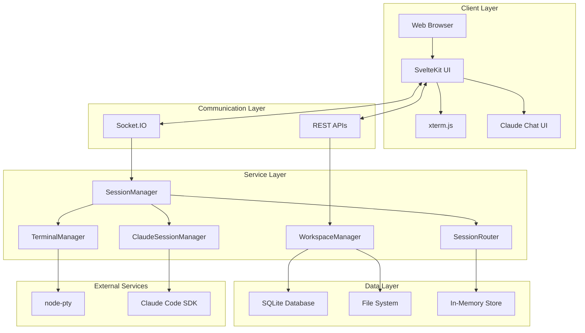

### Component Responsibilities

| Component | Responsibility | Technology |
|-----------|---------------|------------|
| Frontend | User interface, terminal emulation | SvelteKit, xterm.js |
| Socket.IO Layer | Real-time bidirectional communication | Socket.IO 4.x |
| SessionManager | Unified session abstraction | Node.js service |
| SessionRouter | Session mapping and routing | In-memory store |
| WorkspaceManager | Workspace lifecycle and persistence | SQLite + filesystem |
| TerminalManager | PTY session management | node-pty |
| ClaudeSessionManager | AI session integration | Claude Code SDK |

## Frontend Architecture

### Component Hierarchy

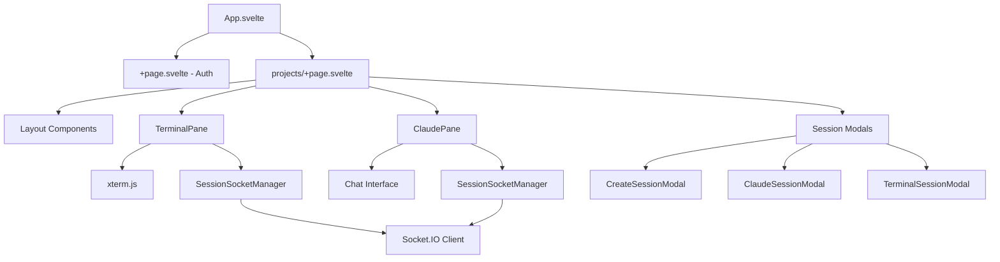

### State Management

The frontend uses Svelte 5's reactive primitives for state management:

```javascript
// Modern reactive pattern example
class SessionStore {
    sessions = $state([]);
    activeSession = $state(null);
    
    activeSessions = $derived(
        this.sessions.filter(s => s.status === 'active')
    );
    
    constructor() {
        $effect(() => {
            // React to state changes
            this.persistState();
        });
    }
}
```

### Key Frontend Components

#### TerminalPane (`src/lib/components/TerminalPane.svelte`)
- Integrates xterm.js for terminal emulation
- Manages terminal lifecycle (create, resize, destroy)
- Handles input/output via Socket.IO
- Implements terminal history and scrollback

#### ClaudePane (`src/lib/components/ClaudePane.svelte`)
- Chat interface for Claude AI interaction
- Message streaming with delta updates
- Markdown rendering and code highlighting
- Conversation history management

#### SessionSocketManager (`src/lib/components/SessionSocketManager.svelte`)
- Centralized Socket.IO connection management
- Authentication handling
- Reconnection logic with exponential backoff
- Event routing to appropriate components

### Frontend Data Flow

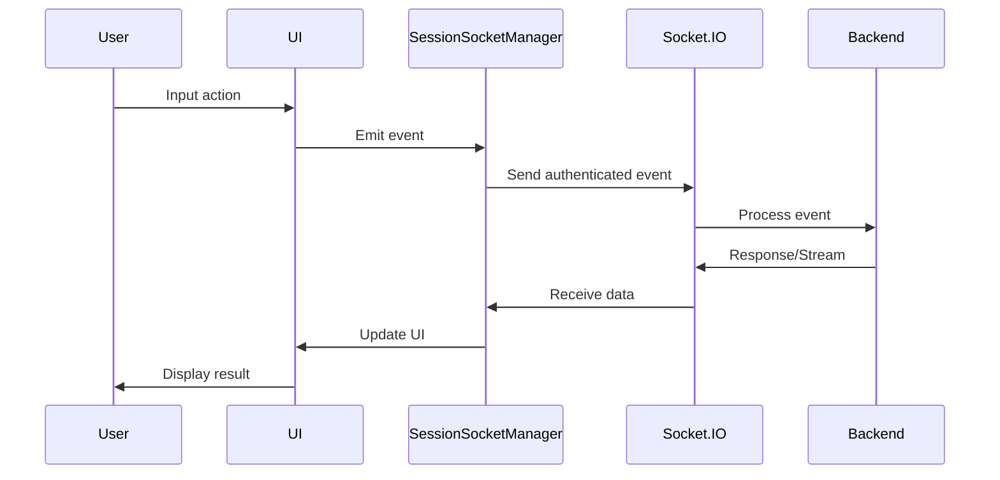

## Backend Architecture

### Service Layer Design

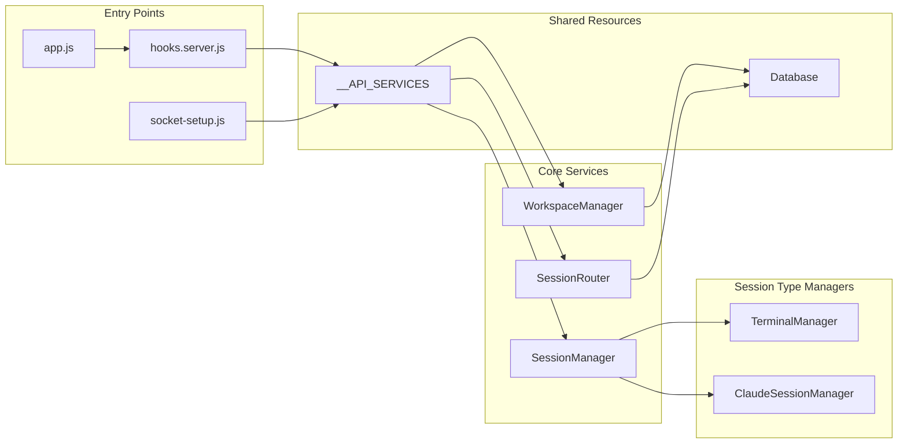

### Core Service Classes

#### SessionManager (`src/lib/server/session-manager.js`)
Unified abstraction layer for all session types:

```javascript
class SessionManager {
    constructor(dependencies) {
        this.sessionRouter = dependencies.sessionRouter;
        this.workspaceManager = dependencies.workspaceManager;
        this.sessionTypes = new Map();
    }
    
    registerType(type, manager) {
        this.sessionTypes.set(type, manager);
    }
    
    async create({ type, workspacePath, options }) {
        const manager = this.sessionTypes.get(type);
        const unifiedId = generateId();
        const session = await manager.create(options);
        
        this.sessionRouter.bind(unifiedId, {
            type,
            specificId: session.id,
            workspacePath
        });
        
        return { id: unifiedId, ...session };
    }
}
```

#### WorkspaceManager (`src/lib/server/core/WorkspaceManager.js`)
Manages workspace lifecycle with database persistence:

```javascript
class WorkspaceManager {
    async open(dir) {
        // Validate path security
        const safePath = this.validatePath(dir);
        
        // Create/open workspace
        await this.ensureDirectory(safePath);
        
        // Update database
        await this.db.upsertWorkspace({
            path: safePath,
            lastAccessed: new Date()
        });
        
        return this.getWorkspaceInfo(safePath);
    }
    
    async rememberSession(workspacePath, sessionDescriptor) {
        // Persist session association
        await this.db.insertWorkspaceSession({
            workspacePath,
            sessionId: sessionDescriptor.id,
            sessionType: sessionDescriptor.type,
            metadata: sessionDescriptor
        });
    }
}
```

#### SessionRouter (`src/lib/server/core/SessionRouter.js`)
In-memory session mapping and routing:

```javascript
class SessionRouter {
    constructor() {
        this.sessions = new Map();
        this.workspaceSessions = new Map();
    }
    
    bind(sessionId, descriptor) {
        this.sessions.set(sessionId, {
            ...descriptor,
            createdAt: Date.now(),
            lastActivity: Date.now()
        });
        
        // Update workspace mapping
        const workspacePath = descriptor.workspacePath;
        if (!this.workspaceSessions.has(workspacePath)) {
            this.workspaceSessions.set(workspacePath, new Set());
        }
        this.workspaceSessions.get(workspacePath).add(sessionId);
    }
}
```

### Session Type Architecture

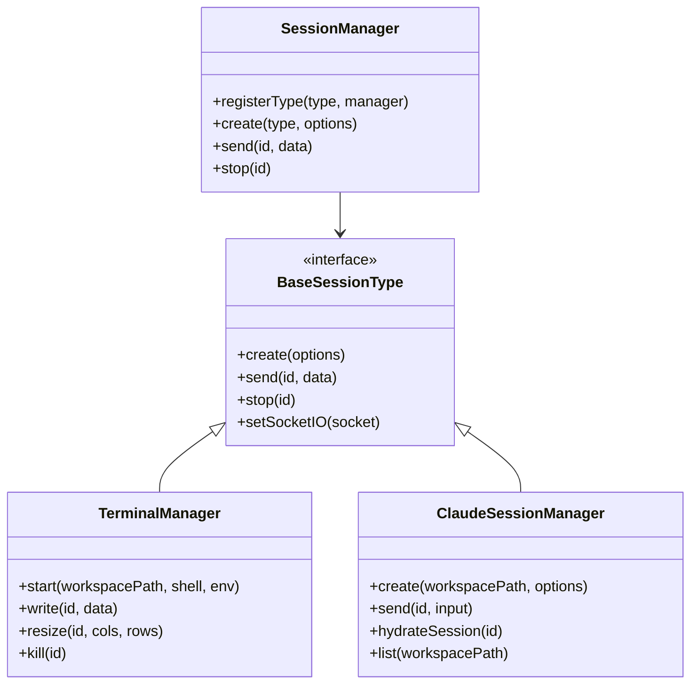

## Communication Layer

### Socket.IO Event Architecture

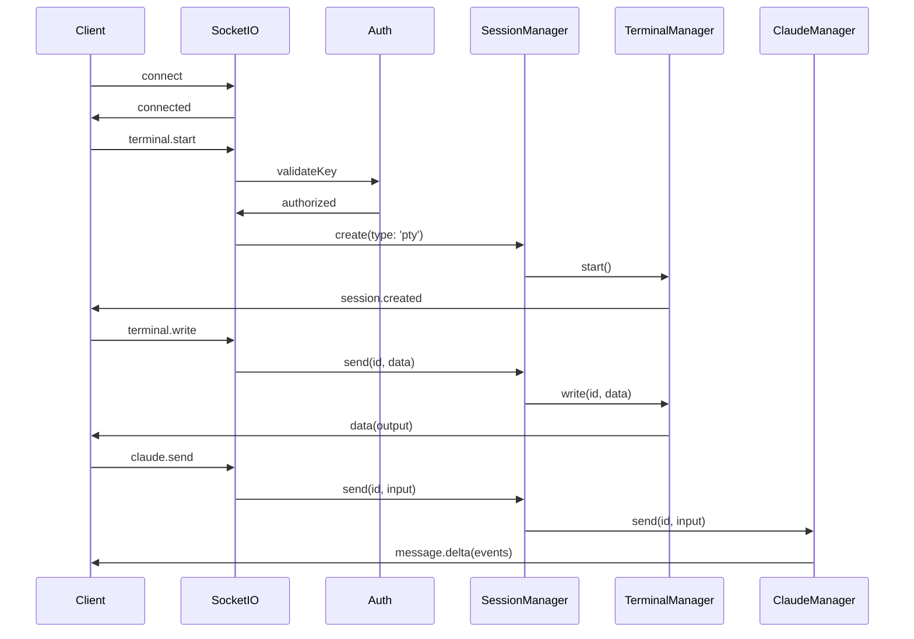

### Event Types and Payloads

#### Client → Server Events

| Event | Payload | Description |
|-------|---------|-------------|
| `terminal.start` | `{key, workspacePath, shell, env}` | Create new terminal session |
| `terminal.write` | `{key, id, data}` | Send input to terminal |
| `terminal.resize` | `{key, id, cols, rows}` | Resize terminal dimensions |
| `claude.send` | `{key, id, input}` | Send message to Claude |
| `session.stop` | `{key, id}` | Terminate session |

#### Server → Client Events

| Event | Payload | Description |
|-------|---------|-------------|
| `data` | `string` | Terminal output data |
| `message.delta` | `Event[]` | Claude response stream |
| `session.created` | `{id, type, workspace}` | Session creation confirmation |
| `session.ended` | `{id, exitCode}` | Session termination |
| `error` | `{message, code}` | Error notification |

### Connection Management

```javascript
// Socket.IO connection lifecycle management
class ConnectionManager {
    constructor(io) {
        this.io = io;
        this.connections = new Map();
        this.setupMiddleware();
    }
    
    setupMiddleware() {
        // Authentication middleware
        this.io.use(async (socket, next) => {
            const key = socket.handshake.auth.key;
            if (await this.validateKey(key)) {
                socket.data.authenticated = true;
                next();
            } else {
                next(new Error('Authentication failed'));
            }
        });
    }
    
    handleConnection(socket) {
        // Track connection
        this.connections.set(socket.id, {
            connectedAt: Date.now(),
            sessions: new Set()
        });
        
        // Setup event handlers
        this.setupEventHandlers(socket);
        
        // Cleanup on disconnect
        socket.on('disconnect', () => {
            this.handleDisconnect(socket);
        });
    }
}
```

## Session Management

### Session Lifecycle

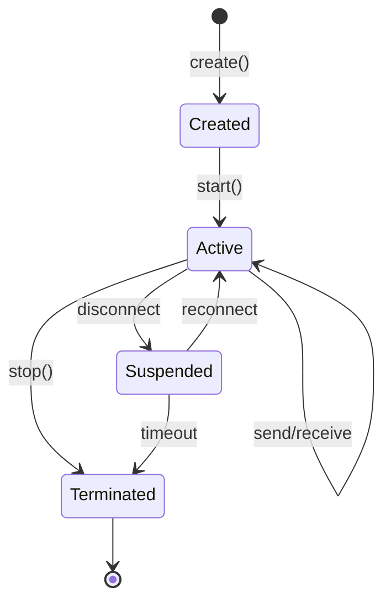

### Unified Session Model

```javascript
// Unified session descriptor
interface SessionDescriptor {
    id: string;              // Unified session ID
    type: 'pty' | 'claude';  // Session type
    specificId: string;      // Type-specific ID
    workspacePath: string;   // Associated workspace
    status: SessionStatus;   // Current status
    createdAt: number;       // Creation timestamp
    lastActivity: number;    // Last activity time
    metadata: object;        // Type-specific metadata
}

// Session status enumeration
enum SessionStatus {
    CREATED = 'created',
    ACTIVE = 'active',
    SUSPENDED = 'suspended',
    TERMINATED = 'terminated'
}
```

### Session Type Registration

```javascript
// Session type registration pattern
class SessionTypeRegistry {
    constructor() {
        this.types = new Map();
        this.validators = new Map();
    }
    
    register(type, config) {
        this.types.set(type, {
            manager: config.manager,
            validator: config.validator,
            defaultOptions: config.defaultOptions
        });
    }
    
    async createSession(type, options) {
        const config = this.types.get(type);
        if (!config) {
            throw new Error(`Unknown session type: ${type}`);
        }
        
        // Validate options
        const validatedOptions = await config.validator(options);
        
        // Create session
        return config.manager.create({
            ...config.defaultOptions,
            ...validatedOptions
        });
    }
}
```

## Workspace Management

### Workspace Structure

```
$WORKSPACES_ROOT/
├── workspace-1/
│   ├── .dispatch/
│   │   ├── sessions.json
│   │   ├── claude/
│   │   │   └── conversation-1.jsonl
│   │   └── history/
│   │       └── terminal-1.txt
│   └── [user files]
├── workspace-2/
└── index.db (SQLite database)
```

### Workspace Operations

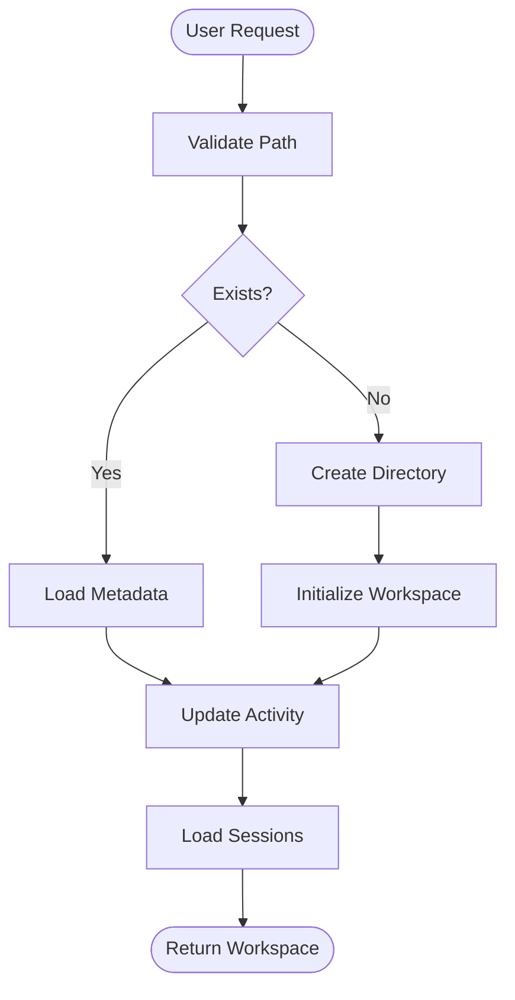

### Workspace Database Schema

```sql
-- Workspaces table
CREATE TABLE workspaces (
    id INTEGER PRIMARY KEY,
    path TEXT UNIQUE NOT NULL,
    name TEXT,
    created_at TIMESTAMP DEFAULT CURRENT_TIMESTAMP,
    last_accessed TIMESTAMP,
    metadata JSON
);

-- Workspace sessions association
CREATE TABLE workspace_sessions (
    id INTEGER PRIMARY KEY,
    workspace_id INTEGER REFERENCES workspaces(id),
    session_id TEXT NOT NULL,
    session_type TEXT NOT NULL,
    created_at TIMESTAMP DEFAULT CURRENT_TIMESTAMP,
    ended_at TIMESTAMP,
    metadata JSON
);

-- Indexes for performance
CREATE INDEX idx_workspace_path ON workspaces(path);
CREATE INDEX idx_session_workspace ON workspace_sessions(workspace_id);
```

## Data Persistence

### Persistence Strategy

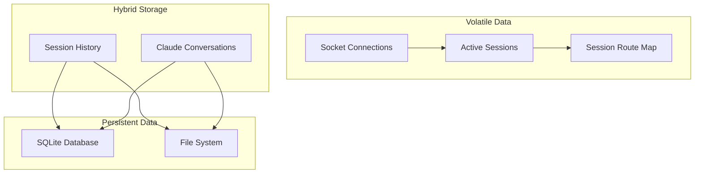

### Database Schema

```sql
-- Sessions table (active socket sessions)
CREATE TABLE sessions (
    id TEXT PRIMARY KEY,
    socket_id TEXT NOT NULL,
    connected_at TIMESTAMP DEFAULT CURRENT_TIMESTAMP,
    last_activity TIMESTAMP,
    metadata JSON
);

-- Session history (audit trail)
CREATE TABLE session_history (
    id INTEGER PRIMARY KEY,
    session_id TEXT NOT NULL,
    event_type TEXT NOT NULL,
    event_data JSON,
    timestamp TIMESTAMP DEFAULT CURRENT_TIMESTAMP
);

-- Terminal history (for session resumption)
CREATE TABLE terminal_history (
    id INTEGER PRIMARY KEY,
    session_id TEXT NOT NULL,
    output TEXT,
    timestamp TIMESTAMP DEFAULT CURRENT_TIMESTAMP
);

-- Claude sessions metadata
CREATE TABLE claude_sessions (
    id TEXT PRIMARY KEY,
    workspace_path TEXT NOT NULL,
    conversation_file TEXT NOT NULL,
    created_at TIMESTAMP DEFAULT CURRENT_TIMESTAMP,
    last_message_at TIMESTAMP,
    metadata JSON
);
```

### Data Retention Policies

```javascript
class DataRetentionManager {
    constructor(db, config) {
        this.db = db;
        this.retentionDays = config.retentionDays || 30;
    }
    
    async cleanupOldData() {
        const cutoffDate = new Date();
        cutoffDate.setDate(cutoffDate.getDate() - this.retentionDays);
        
        // Clean old session history
        await this.db.run(`
            DELETE FROM session_history 
            WHERE timestamp < ?
        `, cutoffDate);
        
        // Clean terminal history
        await this.db.run(`
            DELETE FROM terminal_history 
            WHERE timestamp < ?
        `, cutoffDate);
        
        // Archive old Claude conversations
        await this.archiveClaudeConversations(cutoffDate);
    }
}
```

## Authentication & Security

### Security Architecture

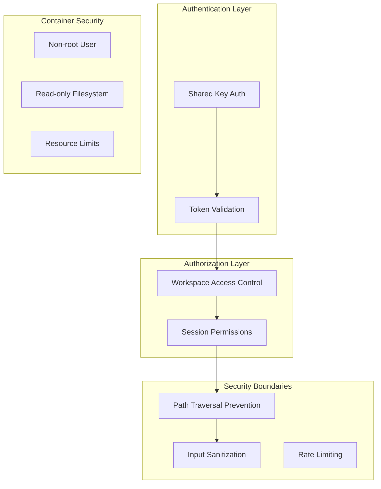

### Authentication Flow

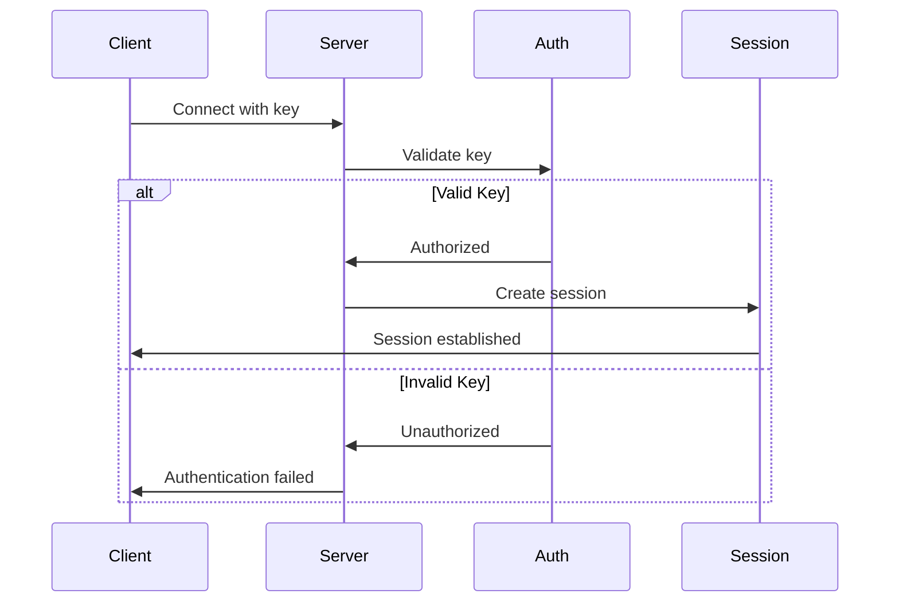

### Security Implementation

```javascript
class SecurityManager {
    constructor(config) {
        this.terminalKey = config.TERMINAL_KEY;
        this.workspaceRoot = config.WORKSPACES_ROOT;
        this.rateLimiter = new RateLimiter(config.rateLimits);
    }
    
    // Path traversal prevention
    validatePath(requestedPath) {
        const resolved = path.resolve(this.workspaceRoot, requestedPath);
        if (!resolved.startsWith(this.workspaceRoot)) {
            throw new SecurityError('Path traversal attempt detected');
        }
        return resolved;
    }
    
    // Input sanitization
    sanitizeInput(input) {
        // Remove control characters except specific allowed ones
        return input.replace(/[\x00-\x08\x0B\x0C\x0E-\x1F\x7F]/g, '');
    }
    
    // Rate limiting
    async checkRateLimit(clientId, action) {
        const allowed = await this.rateLimiter.check(clientId, action);
        if (!allowed) {
            throw new SecurityError('Rate limit exceeded');
        }
    }
}
```

## Build & Deployment

### Build Pipeline

```mermaid
graph LR
    subgraph "Development"
        Code[Source Code]
        Dev[Vite Dev Server]
        Test[Test Suite]
    end
    
    subgraph "Build Stage"
        Compile[SvelteKit Build]
        Bundle[Bundle Assets]
        Optimize[Optimization]
    end
    
    subgraph "Container Build"
        DockerBuild[Docker Multi-stage]
        Security[Security Scan]
        Push[Registry Push]
    end
    
    subgraph "Deployment"
        Pull[Pull Image]
        Configure[Environment Config]
        Run[Container Runtime]
    end
    
    Code --> Dev
    Dev --> Test
    Test --> Compile
    Compile --> Bundle
    Bundle --> Optimize
    Optimize --> DockerBuild
    DockerBuild --> Security
    Security --> Push
    Push --> Pull
    Pull --> Configure
    Configure --> Run
```

### Docker Multi-stage Build

```dockerfile
# Build stage
FROM node:22-slim AS builder
WORKDIR /app
COPY package*.json ./
RUN npm ci --only=production
COPY . .
RUN npm run build

# Runtime stage
FROM node:22-slim
RUN useradd -m -u 10001 appuser
WORKDIR /app
COPY --from=builder --chown=appuser:appuser /app/build ./build
COPY --from=builder --chown=appuser:appuser /app/node_modules ./node_modules
USER appuser
EXPOSE 3030
CMD ["node", "build"]
```

### Deployment Configuration

```yaml
# docker-compose.yml
version: '3.8'
services:
  dispatch:
    image: dispatch:latest
    environment:
      - TERMINAL_KEY=${TERMINAL_KEY}
      - WORKSPACES_ROOT=/data/workspaces
      - DATABASE_PATH=/data/dispatch.db
    volumes:
      - workspace-data:/data/workspaces
      - db-data:/data
    ports:
      - "3030:3030"
    restart: unless-stopped
    security_opt:
      - no-new-privileges:true
    read_only: true
    tmpfs:
      - /tmp
```

## Testing Architecture

### Test Strategy

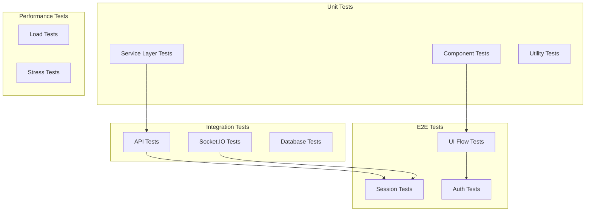

### Test Configuration

```javascript
// vitest.config.js
export default defineConfig({
    test: {
        projects: [
            {
                name: 'client',
                environment: 'happy-dom',
                include: ['src/**/*.client.test.js']
            },
            {
                name: 'server',
                environment: 'node',
                include: ['src/**/*.server.test.js']
            }
        ],
        coverage: {
            reporter: ['text', 'json', 'html'],
            exclude: ['node_modules', '.svelte-kit']
        }
    }
});
```

### Example Test Patterns

```javascript
// Service layer test
describe('SessionManager', () => {
    let manager;
    let mockRouter;
    let mockWorkspace;
    
    beforeEach(() => {
        mockRouter = createMockRouter();
        mockWorkspace = createMockWorkspace();
        manager = new SessionManager({
            sessionRouter: mockRouter,
            workspaceManager: mockWorkspace
        });
    });
    
    test('should create session with unified ID', async () => {
        const session = await manager.create({
            type: 'pty',
            workspacePath: '/test',
            options: { shell: '/bin/bash' }
        });
        
        expect(session.id).toMatch(/^[a-z0-9]{8}$/);
        expect(mockRouter.bind).toHaveBeenCalledWith(
            session.id,
            expect.objectContaining({ type: 'pty' })
        );
    });
});

// E2E test
test('complete session lifecycle', async ({ page }) => {
    // Authenticate
    await page.goto('/');
    await page.fill('#terminal-key', 'testkey12345');
    await page.click('button[type="submit"]');
    
    // Create session
    await page.click('[data-testid="new-session"]');
    await page.selectOption('[name="type"]', 'terminal');
    await page.click('[data-testid="create"]');
    
    // Verify terminal
    await expect(page.locator('.xterm')).toBeVisible();
    
    // Send command
    await page.keyboard.type('echo "test"');
    await page.keyboard.press('Enter');
    
    // Verify output
    await expect(page.locator('.xterm')).toContainText('test');
});
```

## Architectural Recommendations

### 1. Improve Service Layer Testability

**Current Issue**: Services have tight coupling and complex dependencies making unit testing difficult.

**Recommendation**: Implement dependency injection and interface-based design.

```javascript
// Proposed improvement: Interface-based services
interface ISessionManager {
    create(type: string, options: object): Promise<Session>;
    stop(id: string): Promise<void>;
    send(id: string, data: any): Promise<void>;
}

class SessionManager implements ISessionManager {
    constructor(private deps: SessionManagerDeps) {}
    
    // Implementation with clear dependencies
}

// Dependency injection container
class ServiceContainer {
    private services = new Map();
    
    register<T>(token: string, factory: () => T): void {
        this.services.set(token, factory);
    }
    
    get<T>(token: string): T {
        return this.services.get(token)();
    }
}
```

### 2. Implement Event-Driven Architecture

**Current Issue**: Direct coupling between services for state changes.

**Recommendation**: Use event bus for decoupled communication.

```javascript
// Proposed event bus implementation
class EventBus extends EventEmitter {
    private handlers = new Map<string, Set<Handler>>();
    
    subscribe(event: string, handler: Handler): void {
        if (!this.handlers.has(event)) {
            this.handlers.set(event, new Set());
        }
        this.handlers.get(event).add(handler);
    }
    
    publish(event: string, data: any): void {
        const handlers = this.handlers.get(event);
        if (handlers) {
            handlers.forEach(handler => handler(data));
        }
    }
}

// Usage in services
class WorkspaceManager {
    constructor(private eventBus: EventBus) {
        this.eventBus.subscribe('session.created', this.handleSessionCreated);
    }
    
    async open(path: string) {
        const workspace = await this.createWorkspace(path);
        this.eventBus.publish('workspace.opened', workspace);
        return workspace;
    }
}
```

### 3. Add Circuit Breaker Pattern

**Current Issue**: No resilience for external service failures (Claude API, filesystem).

**Recommendation**: Implement circuit breakers for fault tolerance.

```javascript
class CircuitBreaker {
    private failureCount = 0;
    private lastFailureTime = 0;
    private state: 'CLOSED' | 'OPEN' | 'HALF_OPEN' = 'CLOSED';
    
    constructor(
        private threshold = 5,
        private timeout = 60000
    ) {}
    
    async execute<T>(fn: () => Promise<T>): Promise<T> {
        if (this.state === 'OPEN') {
            if (Date.now() - this.lastFailureTime > this.timeout) {
                this.state = 'HALF_OPEN';
            } else {
                throw new Error('Circuit breaker is OPEN');
            }
        }
        
        try {
            const result = await fn();
            this.onSuccess();
            return result;
        } catch (error) {
            this.onFailure();
            throw error;
        }
    }
    
    private onSuccess(): void {
        this.failureCount = 0;
        this.state = 'CLOSED';
    }
    
    private onFailure(): void {
        this.failureCount++;
        this.lastFailureTime = Date.now();
        if (this.failureCount >= this.threshold) {
            this.state = 'OPEN';
        }
    }
}
```

### 4. Implement Repository Pattern for Data Access

**Current Issue**: Direct database access scattered across services.

**Recommendation**: Centralize data access through repositories.

```javascript
// Repository interface
interface IWorkspaceRepository {
    findById(id: string): Promise<Workspace>;
    findByPath(path: string): Promise<Workspace>;
    save(workspace: Workspace): Promise<void>;
    delete(id: string): Promise<void>;
}

// Implementation
class SQLiteWorkspaceRepository implements IWorkspaceRepository {
    constructor(private db: Database) {}
    
    async findByPath(path: string): Promise<Workspace> {
        const row = await this.db.get(
            'SELECT * FROM workspaces WHERE path = ?',
            path
        );
        return this.mapRowToWorkspace(row);
    }
    
    private mapRowToWorkspace(row: any): Workspace {
        return new Workspace({
            id: row.id,
            path: row.path,
            metadata: JSON.parse(row.metadata)
        });
    }
}

// Usage in service
class WorkspaceManager {
    constructor(private repository: IWorkspaceRepository) {}
    
    async open(path: string): Promise<Workspace> {
        let workspace = await this.repository.findByPath(path);
        if (!workspace) {
            workspace = new Workspace({ path });
            await this.repository.save(workspace);
        }
        return workspace;
    }
}
```

### 5. Add Comprehensive Monitoring

**Current Issue**: Limited observability into system behavior.

**Recommendation**: Implement structured logging and metrics.

```javascript
// Monitoring service
class MonitoringService {
    private metrics = new Map<string, number>();
    
    incrementCounter(name: string, tags?: object): void {
        const key = this.buildKey(name, tags);
        this.metrics.set(key, (this.metrics.get(key) || 0) + 1);
    }
    
    recordGauge(name: string, value: number, tags?: object): void {
        const key = this.buildKey(name, tags);
        this.metrics.set(key, value);
    }
    
    recordHistogram(name: string, value: number, tags?: object): void {
        // Record distribution metrics
    }
}

// Structured logging
class Logger {
    log(level: string, message: string, context?: object): void {
        const entry = {
            timestamp: new Date().toISOString(),
            level,
            message,
            ...context
        };
        console.log(JSON.stringify(entry));
    }
}

// Usage
class SessionManager {
    constructor(
        private monitoring: MonitoringService,
        private logger: Logger
    ) {}
    
    async create(type: string, options: object): Promise<Session> {
        const startTime = Date.now();
        
        try {
            const session = await this.doCreate(type, options);
            
            this.monitoring.incrementCounter('session.created', { type });
            this.monitoring.recordHistogram(
                'session.creation.duration',
                Date.now() - startTime,
                { type }
            );
            
            this.logger.log('info', 'Session created', {
                sessionId: session.id,
                type,
                duration: Date.now() - startTime
            });
            
            return session;
        } catch (error) {
            this.monitoring.incrementCounter('session.creation.failed', { type });
            this.logger.log('error', 'Session creation failed', {
                type,
                error: error.message
            });
            throw error;
        }
    }
}
```

### 6. Implement Saga Pattern for Complex Workflows

**Current Issue**: Complex multi-step operations lack transaction support.

**Recommendation**: Use saga pattern for distributed transactions.

```javascript
// Saga implementation
class CreateSessionSaga {
    private steps = [
        this.validateWorkspace,
        this.allocateResources,
        this.createSession,
        this.registerSession,
        this.notifyClients
    ];
    
    private compensations = [
        this.releaseWorkspace,
        this.releaseResources,
        this.destroySession,
        this.unregisterSession,
        null // No compensation for notification
    ];
    
    async execute(params: CreateSessionParams): Promise<Session> {
        const completed = [];
        
        try {
            let result = params;
            for (const step of this.steps) {
                result = await step.call(this, result);
                completed.push(step);
            }
            return result;
        } catch (error) {
            // Compensate in reverse order
            for (let i = completed.length - 1; i >= 0; i--) {
                const compensation = this.compensations[i];
                if (compensation) {
                    await compensation.call(this, params);
                }
            }
            throw error;
        }
    }
}
```

### 7. Add Request/Response Validation

**Current Issue**: Insufficient input validation and type safety.

**Recommendation**: Implement schema validation for all inputs.

```javascript
// Schema validation using zod
import { z } from 'zod';

// Define schemas
const CreateSessionSchema = z.object({
    type: z.enum(['pty', 'claude']),
    workspacePath: z.string().min(1),
    options: z.object({
        shell: z.string().optional(),
        env: z.record(z.string()).optional()
    })
});

// Validation middleware
function validate(schema: z.ZodSchema) {
    return (req, res, next) => {
        try {
            req.validated = schema.parse(req.body);
            next();
        } catch (error) {
            res.status(400).json({
                error: 'Validation failed',
                details: error.errors
            });
        }
    };
}

// Usage in routes
app.post('/api/sessions',
    validate(CreateSessionSchema),
    async (req, res) => {
        const session = await sessionManager.create(req.validated);
        res.json(session);
    }
);
```

### 8. Implement Caching Strategy

**Current Issue**: Repeated database queries and computations.

**Recommendation**: Add multi-level caching.

```javascript
// Cache implementation
class CacheManager {
    private memory = new Map();
    private redis?: RedisClient;
    
    async get<T>(key: string): Promise<T | null> {
        // L1: Memory cache
        if (this.memory.has(key)) {
            return this.memory.get(key);
        }
        
        // L2: Redis cache
        if (this.redis) {
            const value = await this.redis.get(key);
            if (value) {
                const parsed = JSON.parse(value);
                this.memory.set(key, parsed);
                return parsed;
            }
        }
        
        return null;
    }
    
    async set<T>(key: string, value: T, ttl?: number): Promise<void> {
        this.memory.set(key, value);
        
        if (this.redis) {
            await this.redis.set(
                key,
                JSON.stringify(value),
                ttl ? ['EX', ttl] : []
            );
        }
        
        if (ttl) {
            setTimeout(() => this.memory.delete(key), ttl * 1000);
        }
    }
}

// Usage in service
class WorkspaceManager {
    constructor(
        private cache: CacheManager,
        private repository: IWorkspaceRepository
    ) {}
    
    async getWorkspace(path: string): Promise<Workspace> {
        const cacheKey = `workspace:${path}`;
        
        let workspace = await this.cache.get<Workspace>(cacheKey);
        if (workspace) {
            return workspace;
        }
        
        workspace = await this.repository.findByPath(path);
        await this.cache.set(cacheKey, workspace, 300); // 5 min TTL
        
        return workspace;
    }
}
```

### 9. Add Health Checks and Readiness Probes

**Current Issue**: No standardized health monitoring.

**Recommendation**: Implement comprehensive health checks.

```javascript
// Health check service
class HealthCheckService {
    private checks = new Map<string, HealthCheck>();
    
    register(name: string, check: HealthCheck): void {
        this.checks.set(name, check);
    }
    
    async checkHealth(): Promise<HealthStatus> {
        const results = new Map<string, CheckResult>();
        
        for (const [name, check] of this.checks) {
            try {
                const start = Date.now();
                await check.check();
                results.set(name, {
                    status: 'healthy',
                    duration: Date.now() - start
                });
            } catch (error) {
                results.set(name, {
                    status: 'unhealthy',
                    error: error.message
                });
            }
        }
        
        const healthy = Array.from(results.values())
            .every(r => r.status === 'healthy');
        
        return {
            status: healthy ? 'healthy' : 'unhealthy',
            checks: Object.fromEntries(results)
        };
    }
}

// Health check implementations
class DatabaseHealthCheck implements HealthCheck {
    constructor(private db: Database) {}
    
    async check(): Promise<void> {
        await this.db.get('SELECT 1');
    }
}

class ClaudeHealthCheck implements HealthCheck {
    constructor(private claude: ClaudeService) {}
    
    async check(): Promise<void> {
        await this.claude.ping();
    }
}

// Health endpoint
app.get('/health', async (req, res) => {
    const health = await healthService.checkHealth();
    res.status(health.status === 'healthy' ? 200 : 503)
       .json(health);
});
```

### 10. Improve Type Safety

**Current Issue**: Loose typing in critical paths.

**Recommendation**: Strengthen TypeScript usage.

```typescript
// Strong typing for domain models
interface Session {
    readonly id: string;
    readonly type: SessionType;
    readonly workspacePath: string;
    readonly status: SessionStatus;
    readonly createdAt: Date;
    readonly lastActivity: Date;
}

type SessionType = 'pty' | 'claude';
type SessionStatus = 'created' | 'active' | 'suspended' | 'terminated';

// Type-safe event system
interface SessionEvents {
    'session.created': { session: Session };
    'session.terminated': { sessionId: string; reason: string };
    'session.error': { sessionId: string; error: Error };
}

class TypedEventEmitter<T extends Record<string, any>> {
    private emitter = new EventEmitter();
    
    on<K extends keyof T>(event: K, handler: (data: T[K]) => void): void {
        this.emitter.on(event as string, handler);
    }
    
    emit<K extends keyof T>(event: K, data: T[K]): void {
        this.emitter.emit(event as string, data);
    }
}

// Usage
class SessionManager {
    private events = new TypedEventEmitter<SessionEvents>();
    
    async create(params: CreateSessionParams): Promise<Session> {
        const session = await this.doCreate(params);
        this.events.emit('session.created', { session });
        return session;
    }
}
```

## Summary

The Dispatch application demonstrates solid architectural foundations with clear separation of concerns, real-time communication capabilities, and extensible session management. The recommendations focus on improving testability, resilience, and maintainability through:

1. **Dependency injection** for better testability
2. **Event-driven architecture** for decoupled services
3. **Circuit breakers** for fault tolerance
4. **Repository pattern** for data access
5. **Comprehensive monitoring** for observability
6. **Saga pattern** for complex workflows
7. **Input validation** for security
8. **Caching strategies** for performance
9. **Health checks** for reliability
10. **Strong typing** for code quality

Implementing these recommendations will result in a more robust, maintainable, and scalable architecture that can evolve with changing requirements while maintaining high code quality and system reliability.