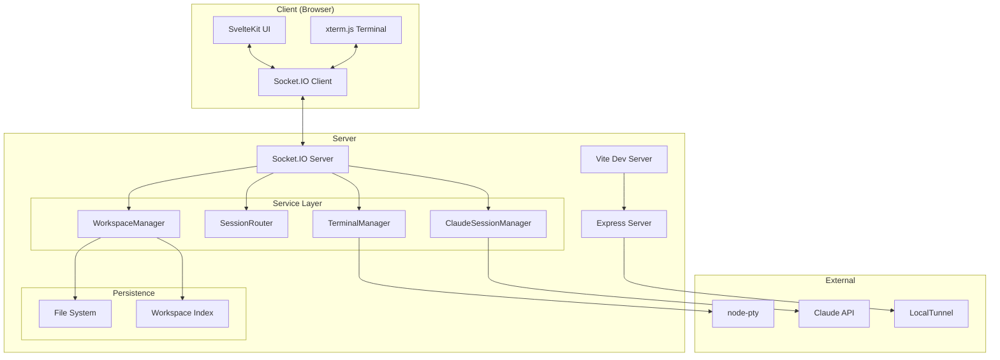
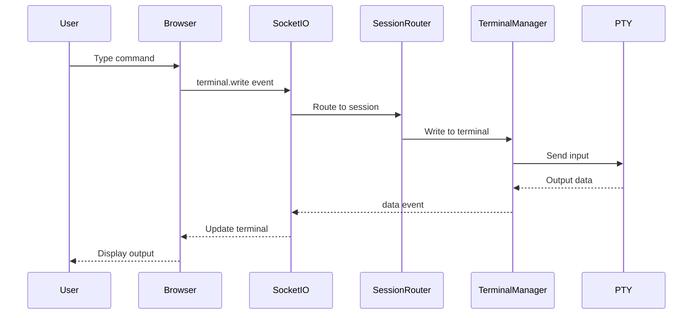
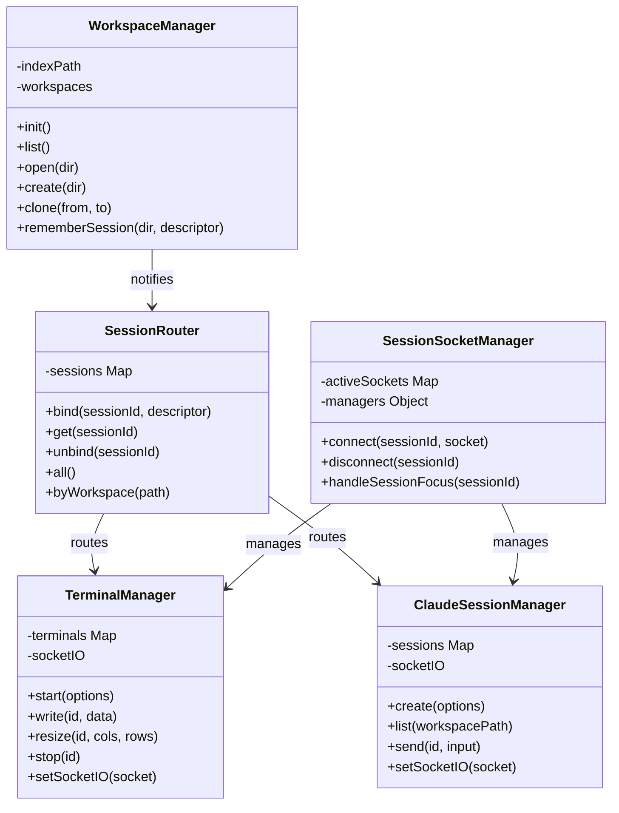
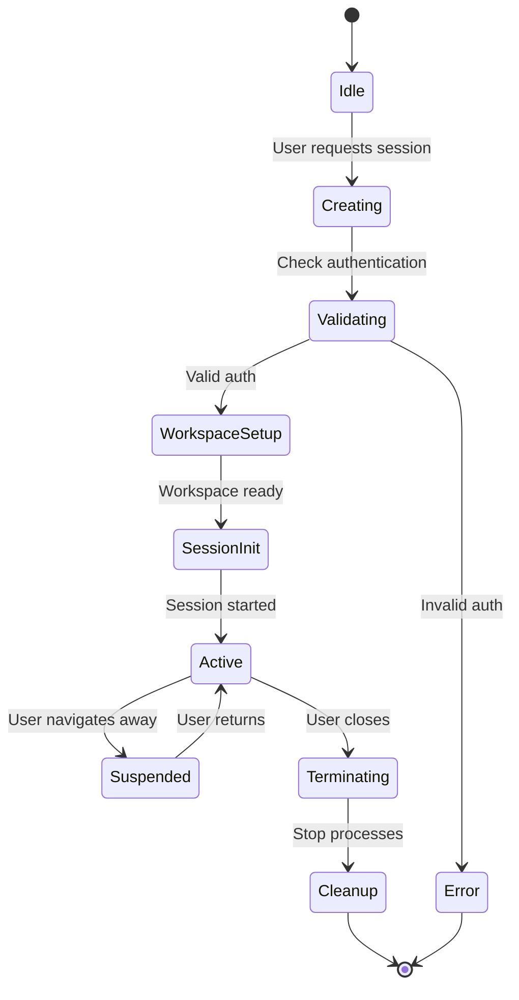
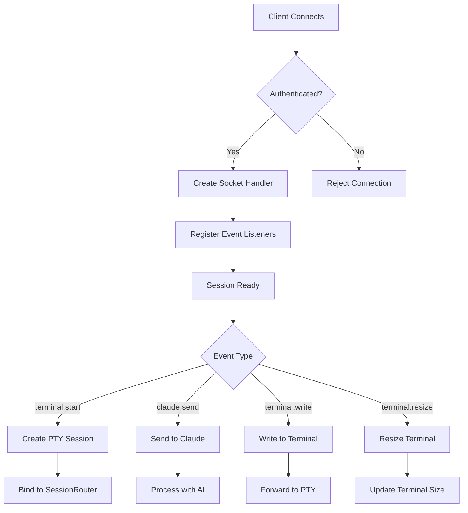
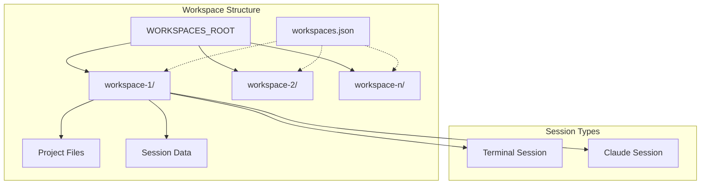
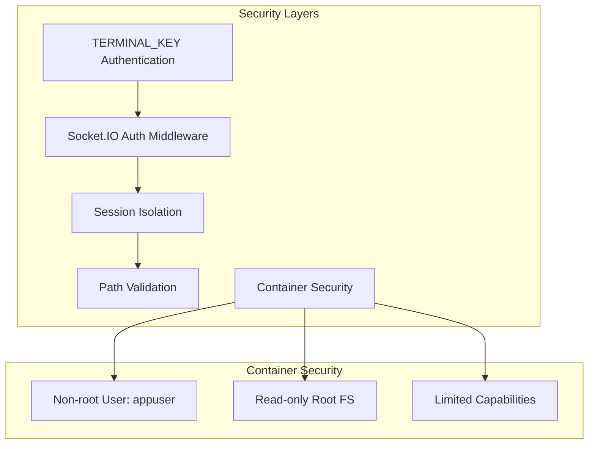
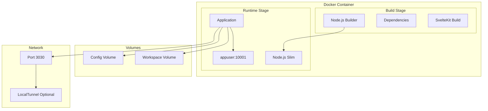
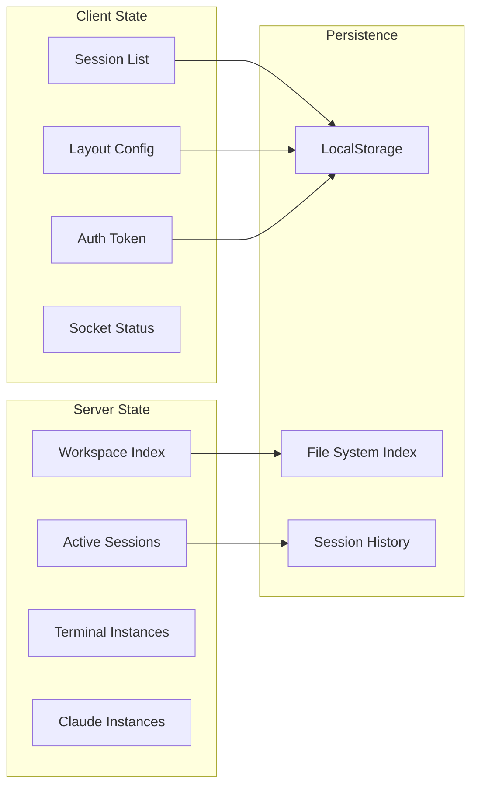

# Dispatch Architecture Overview

## Executive Summary

Dispatch is a containerized web application that provides browser-based terminal and Claude AI sessions. Built with SvelteKit and Socket.IO, it enables real-time, interactive development environments accessible through any web browser. The application supports multiple concurrent sessions, workspace management, and seamless integration with Claude Code for AI-assisted development.

## Core Architecture

### System Components



### Data Flow



## Component Architecture

### Frontend Architecture

```mermaid
graph LR
    subgraph "SvelteKit Frontend"
        ROUTES[Routes]
        COMPONENTS[Components]
        STORES[State Management]
        
        subgraph "Pages"
            HOME[/ - Main Terminal]
            PROJECTS[/projects - Session Grid]
        end
        
        subgraph "Core Components"
            TERM_PANE[TerminalPane]
            CLAUDE_PANE[ClaudePane]
            SESSION_MGR[SessionSocketManager]
        end
    end
    
    ROUTES --> HOME
    ROUTES --> PROJECTS
    HOME --> TERM_PANE
    PROJECTS --> TERM_PANE
    PROJECTS --> CLAUDE_PANE
    TERM_PANE --> SESSION_MGR
    CLAUDE_PANE --> SESSION_MGR
```

### Backend Service Architecture



## Session Lifecycle

### Session Creation Flow



### Socket.IO Connection Management



## Workspace Management



## Security Architecture



## Deployment Architecture



## State Management



## Potential Issues and Concerns

### 1. **Session State Synchronization**
- **Issue**: Socket.IO connections can be lost, causing state desynchronization between client and server
- **Impact**: Terminal output may be lost, Claude conversations interrupted
- **Mitigation**: Implement session replay buffers and automatic reconnection with state recovery

### 2. **Memory Leaks in Long-Running Sessions**
- **Issue**: PTY processes and Claude sessions may accumulate memory over time
- **Impact**: Server performance degradation, potential crashes
- **Mitigation**: Implement session timeouts, memory monitoring, and automatic cleanup of idle sessions

### 3. **Concurrent Session Limits**
- **Issue**: No apparent limits on concurrent terminal/Claude sessions per user
- **Impact**: Resource exhaustion, DoS vulnerability
- **Mitigation**: Implement per-user session limits and resource quotas

### 4. **File System Security**
- **Issue**: Path traversal vulnerabilities in workspace management
- **Current Protection**: Path validation exists but needs thorough testing
- **Risk**: Unauthorized file system access outside workspace boundaries
- **Mitigation**: Strengthen path sanitization, use chroot/containers for isolation

### 5. **Authentication Weakness**
- **Issue**: Single shared TERMINAL_KEY for all users
- **Impact**: No user isolation, shared access to all sessions
- **Mitigation**: Implement proper user authentication, JWT tokens, session-based auth

### 6. **Socket.IO Scaling**
- **Issue**: Single Socket.IO server instance, no clustering support
- **Impact**: Limited concurrent connections, single point of failure
- **Mitigation**: Implement Socket.IO Redis adapter for horizontal scaling

### 7. **Claude API Rate Limiting**
- **Issue**: No apparent rate limiting or quota management for Claude API calls
- **Impact**: Potential API quota exhaustion, unexpected costs
- **Mitigation**: Implement rate limiting, usage tracking, and quota management

### 8. **Session Persistence Reliability**
- **Issue**: Session state stored only in memory and local file system
- **Impact**: Data loss on server restart or crash
- **Mitigation**: Implement proper database backend for session state

### 9. **LocalTunnel Security**
- **Issue**: When enabled, exposes application to public internet
- **Impact**: Potential unauthorized access, security vulnerabilities
- **Mitigation**: Implement additional authentication layers, IP whitelisting

### 10. **WebSocket Message Validation**
- **Issue**: Limited validation of Socket.IO message payloads
- **Impact**: Potential for malformed data causing crashes or exploits
- **Mitigation**: Implement comprehensive input validation and sanitization

### 11. **Container Escape Risks**
- **Issue**: PTY sessions run with container user privileges
- **Impact**: Potential container escape through PTY exploits
- **Mitigation**: Use additional sandboxing, security profiles, capability dropping

### 12. **Cross-Session Data Leakage**
- **Issue**: Shared service managers across all sessions
- **Impact**: Potential for data leakage between user sessions
- **Mitigation**: Implement proper session isolation at service layer

### 13. **Performance Bottlenecks**
- **Issue**: All operations are synchronous in service managers
- **Impact**: One slow operation blocks all other sessions
- **Mitigation**: Implement async/queue-based processing

### 14. **Error Recovery**
- **Issue**: Limited error handling and recovery mechanisms
- **Impact**: Single error can crash entire application
- **Mitigation**: Implement comprehensive error boundaries and recovery strategies

### 15. **Monitoring and Observability**
- **Issue**: Minimal logging and monitoring capabilities
- **Impact**: Difficult to debug issues in production
- **Mitigation**: Implement structured logging, metrics, and tracing

## Recommendations

### High Priority
1. Implement proper user authentication and authorization
2. Add session and resource limits
3. Strengthen input validation and sanitization
4. Implement comprehensive error handling
5. Add monitoring and observability

### Medium Priority
1. Implement session state persistence in database
2. Add horizontal scaling support
3. Implement rate limiting for API calls
4. Add comprehensive audit logging
5. Implement automated testing suite

### Low Priority
1. Add support for custom workspace templates
2. Implement session sharing capabilities
3. Add plugin architecture for extensions
4. Implement advanced terminal features (tabs, splits)
5. Add support for multiple AI providers

## Conclusion

Dispatch provides a powerful web-based development environment with terminal and AI assistance. While the architecture is well-structured with clear separation of concerns, several security and scalability concerns need to be addressed before production deployment. The modular design allows for incremental improvements and the addition of enterprise features like proper authentication, monitoring, and scaling capabilities.