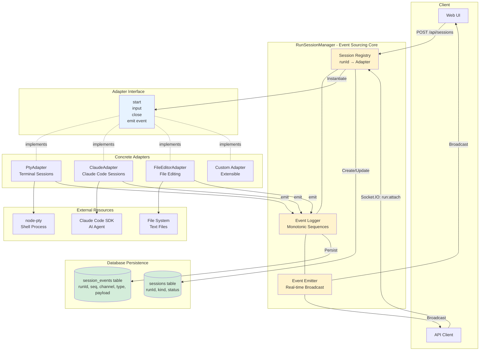

# Session Management Architecture

This diagram illustrates the unified session management system built on event sourcing principles, showing how RunSessionManager coordinates different session types through adapters.

## Core Concepts

### RunSessionManager Responsibilities
1. **Session Registry**: Maps runId to adapter instances, manages session lifecycle
2. **Event Sourcing**: All session activity logged as immutable events with sequence numbers
3. **Event Replay**: Clients can rebuild state from any (runId, seq) cursor
4. **Multi-Client Support**: Multiple tabs/clients attach to same session with synchronized state

### Adapter Pattern
- **Interface Contract**: All adapters implement `start()`, `input()`, `close()`, and emit events
- **Isolation**: Each session type encapsulated in its own adapter
- **Registration**: Adapters registered at startup via `RunSessionManager.registerAdapter(kind, AdapterClass)`
- **Extensibility**: New session types added by creating new adapter classes

### Event Sourcing Benefits
- **Auditability**: Complete history of all session interactions
- **Replay**: Reconstruct session state at any point in time
- **Debugging**: Trace exact sequence of events that led to any state
- **Multi-Client Sync**: Late-joining clients catch up by replaying missed events

## Session Lifecycle

1. **Creation**: Client requests session → RunSessionManager creates record in database → Instantiates adapter
2. **Attachment**: Client attaches via Socket.IO → Receives events from specified sequence number
3. **Interaction**: Client sends input → Adapter processes → Emits events → Logged and broadcast
4. **Persistence**: All events stored with monotonic sequence numbers for replay
5. **Termination**: Client closes session → Adapter cleanup → Session marked as closed in database

## Event Structure

All events follow a consistent structure:
- **runId**: Session identifier
- **seq**: Monotonic sequence number (1, 2, 3, ...)
- **channel**: Event category (e.g., 'stdout', 'stderr', 'status')
- **type**: Event type within channel (e.g., 'data', 'error', 'exit')
- **payload**: Event-specific data
- **timestamp**: Event creation time

This structure enables:
- Deterministic replay
- Channel-based filtering
- Ordered event processing
- Time-based analysis
