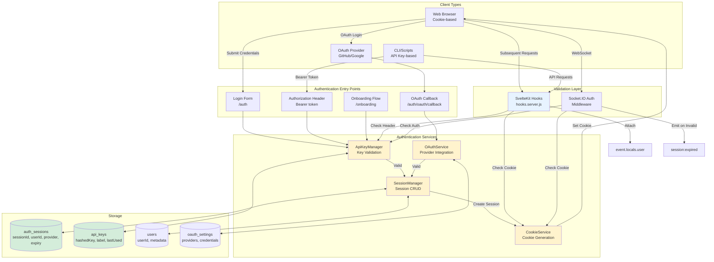

# Authentication System

This diagram shows the dual authentication system supporting both session cookies (for browser clients) and API keys (for programmatic access), along with optional OAuth integration.



## Authentication Methods

### 1. Session Cookie Authentication (Browser Clients)
- **Use Case**: Web browser access
- **Flow**: Login → Validate API key → Create session → Set httpOnly cookie
- **Security**:
  - Secure flag in production (HTTPS only)
  - SameSite=Lax for CSRF protection
  - 30-day expiration with 24-hour refresh window
  - bcrypt-hashed session IDs (cost factor 12)

### 2. API Key Authentication (Programmatic Access)
- **Use Case**: CLI tools, scripts, automation
- **Flow**: Include `Authorization: Bearer {key}` header → Validate key → Grant access
- **Security**:
  - 32-byte base64url random keys
  - bcrypt hashed storage (cost factor 12)
  - Constant-time comparison
  - Shown only once at creation
  - Tracks last used timestamp

### 3. OAuth Authentication (Optional)
- **Providers**: GitHub, Google (configurable)
- **Flow**: Redirect to provider → Callback with code → Exchange for tokens → Create session
- **Configuration**: Managed via `/settings/oauth` UI
- **Security**:
  - Client secrets encrypted at rest
  - State parameter for CSRF protection
  - Fallback to API key login if provider unavailable

## Middleware Architecture

### SvelteKit Hooks (hooks.server.js)
```javascript
async function handle({ event, resolve }) {
  // 1. Try cookie authentication
  const cookieAuth = await CookieService.validateSessionCookie(event);

  // 2. Fallback to API key from header
  if (!cookieAuth) {
    const apiKeyAuth = await ApiKeyManager.verifyApiKey(event);
    if (apiKeyAuth) {
      event.locals.user = apiKeyAuth.user;
    }
  }

  // 3. Attach user to event.locals for downstream use
  return resolve(event);
}
```

### Socket.IO Middleware
```javascript
io.use(async (socket, next) => {
  // 1. Try cookie from handshake
  const cookieAuth = await validateCookie(socket.request.headers.cookie);

  // 2. Try API key from auth object
  if (!cookieAuth && socket.handshake.auth.apiKey) {
    const apiKeyAuth = await ApiKeyManager.verifyApiKey(socket.handshake.auth.apiKey);
    if (apiKeyAuth) {
      socket.userId = apiKeyAuth.user.id;
      return next();
    }
  }

  // 3. Monitor for session expiration
  socket.on('disconnect', () => {
    if (sessionExpired) {
      socket.emit('session:expired');
    }
  });
});
```

## Session Lifecycle

1. **Creation**:
   - User logs in (API key, OAuth, or onboarding)
   - System generates unique session ID
   - Session stored in database with expiration (30 days)
   - Cookie set on browser (httpOnly, Secure in prod)

2. **Validation**:
   - Every request checks cookie or Authorization header
   - Session looked up in database
   - Expiration checked
   - User attached to request context

3. **Refresh**:
   - If session within 24 hours of expiry
   - Automatic refresh extends session
   - New cookie issued

4. **Termination**:
   - User logs out
   - Session deleted from database
   - Cookie cleared
   - Socket.IO connections notified

## API Key Management

### Creation
- Generated during onboarding or via `/settings/api-keys`
- 32-byte random base64url string
- Displayed once with copy warning
- Immediately usable for authentication

### Storage
- Raw key never stored
- bcrypt hash with cost factor 12
- Includes metadata: label, created_at, last_used_at

### Validation
- Constant-time bcrypt comparison
- Updates last_used_at on success
- Returns associated user object

### Lifecycle
- Can be disabled (soft delete)
- Can be permanently deleted
- Multiple keys per user supported
- Custom labels for identification

## Security Features

- **Password Hashing**: bcrypt with cost factor 12 for session IDs and API keys
- **CSRF Protection**: SameSite=Lax cookies, Origin header validation
- **Constant-Time Comparison**: Prevents timing attacks on key validation
- **Secure Cookies**: httpOnly prevents XSS, Secure flag for HTTPS
- **Session Expiration**: Automatic cleanup of expired sessions
- **OAuth State Parameter**: Prevents CSRF on OAuth flows
- **Encrypted Secrets**: OAuth client secrets encrypted at rest
- **Rate Limiting**: (Recommended) Implement at reverse proxy level
