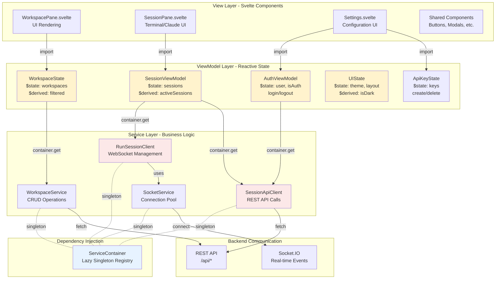

# Frontend MVVM Architecture

This diagram illustrates the Svelte 5 MVVM pattern using runes for reactivity, ServiceContainer for dependency injection, and clean separation between Views, ViewModels, and Services.



## MVVM Pattern with Svelte 5 Runes

### View (Components)
- **Responsibility**: UI rendering and user interaction
- **Technology**: Svelte 5 components (.svelte files)
- **Pattern**: Import ViewModels, bind to reactive state
- **Example**:
```svelte
<script>
  import { sessionViewModel } from '$lib/client/shared/state/SessionViewModel.svelte.js';

  const { activeSessions, createSession } = sessionViewModel;
</script>

{#each activeSessions as session}
  <SessionPane {session} />
{/each}
```

### ViewModel (State Management)
- **Responsibility**: Application state and presentation logic
- **Technology**: Classes with Svelte 5 $state and $derived runes
- **Pattern**: Export singleton instances with reactive properties
- **Example**:
```javascript
class SessionViewModel {
  sessions = $state([]);
  loading = $state(false);

  activeSessions = $derived.by(() => {
    return this.sessions.filter(s => s.status === 'active');
  });

  async createSession(type) {
    this.loading = true;
    const client = container.get('sessionApiClient');
    const session = await client.create(type);
    this.sessions.push(session);
    this.loading = false;
  }
}

export const sessionViewModel = new SessionViewModel();
```

### Service (Business Logic)
- **Responsibility**: Backend communication, complex operations
- **Technology**: Classes or modules (not reactive)
- **Pattern**: Registered in ServiceContainer for dependency injection
- **Example**:
```javascript
class SessionApiClient {
  async create(type) {
    const response = await fetch('/api/sessions', {
      method: 'POST',
      body: JSON.stringify({ type })
    });
    return response.json();
  }
}
```

## ServiceContainer - Dependency Injection

### Purpose
- Centralized service registration and retrieval
- Lazy initialization (services created on first use)
- Singleton pattern (one instance per service)
- Test container support for mocking

### Usage Pattern
```javascript
// 1. Register services at app startup
container.register('sessionApiClient', () => new SessionApiClient());
container.register('socketService', () => new SocketService());

// 2. Retrieve in ViewModels
const client = container.get('sessionApiClient');

// 3. Test container for mocking
const testContainer = createTestContainer({
  'sessionApiClient': mockClient
});
```

## Data Flow

### User Interaction Flow
1. **User clicks button** in View component
2. **Component calls** ViewModel method
3. **ViewModel uses** Service from container
4. **Service makes** API call or WebSocket message
5. **Backend responds** with data
6. **Service returns** to ViewModel
7. **ViewModel updates** $state
8. **Svelte reactivity** updates View automatically

### Real-time Event Flow
1. **Server emits** Socket.IO event
2. **SocketService receives** event
3. **SocketService notifies** RunSessionClient
4. **RunSessionClient updates** SessionViewModel state
5. **Svelte reactivity** updates View automatically

## Directory Structure

```
src/lib/client/
├── shared/
│   ├── services/              # Business Logic Layer
│   │   ├── ServiceContainer.svelte.js
│   │   ├── SessionApiClient.js
│   │   ├── RunSessionClient.js
│   │   ├── SocketService.svelte.js
│   │   └── WorkspaceService.js
│   │
│   ├── state/                 # ViewModel Layer
│   │   ├── SessionViewModel.svelte.js
│   │   ├── SessionState.svelte.js
│   │   ├── WorkspaceState.svelte.js
│   │   ├── UIState.svelte.js
│   │   ├── AuthViewModel.svelte.js
│   │   └── ApiKeyState.svelte.js
│   │
│   └── components/            # Shared View Components
│       ├── Button.svelte
│       ├── Modal.svelte
│       └── ...
│
├── terminal/                  # Terminal Feature
│   ├── TerminalPane.svelte
│   └── ...
│
├── claude/                    # Claude Feature
│   ├── ClaudePane.svelte
│   └── ...
│
└── file-editor/               # File Editor Feature
    ├── FileEditorPane.svelte
    └── ...
```

## Key Architectural Benefits

### Separation of Concerns
- **Views**: Pure UI, no business logic
- **ViewModels**: State management, no DOM manipulation
- **Services**: API integration, no reactivity

### Testability
- ViewModels testable without DOM
- Services testable with mock backends
- Test containers enable dependency injection for tests

### Reusability
- ViewModels shared across multiple views
- Services shared across multiple ViewModels
- Components composed from smaller components

### Maintainability
- Clear ownership of responsibilities
- Easy to locate and modify specific functionality
- Predictable data flow

### Type Safety
- JSDoc types on all methods
- IDE autocompletion support
- Runtime type validation where needed

## Common Patterns

### Computed Properties
Use `$derived` for values computed from state:
```javascript
filteredItems = $derived.by(() => {
  return this.items.filter(item => item.active);
});
```

### Asynchronous Operations
Use async methods in ViewModels, update state when complete:
```javascript
async loadData() {
  this.loading = true;
  this.error = null;
  try {
    const data = await service.fetch();
    this.items = data;
  } catch (e) {
    this.error = e.message;
  } finally {
    this.loading = false;
  }
}
```

### Service Dependencies
Services can depend on other services via container:
```javascript
class RunSessionClient {
  constructor() {
    this.socketService = container.get('socketService');
  }
}
```
