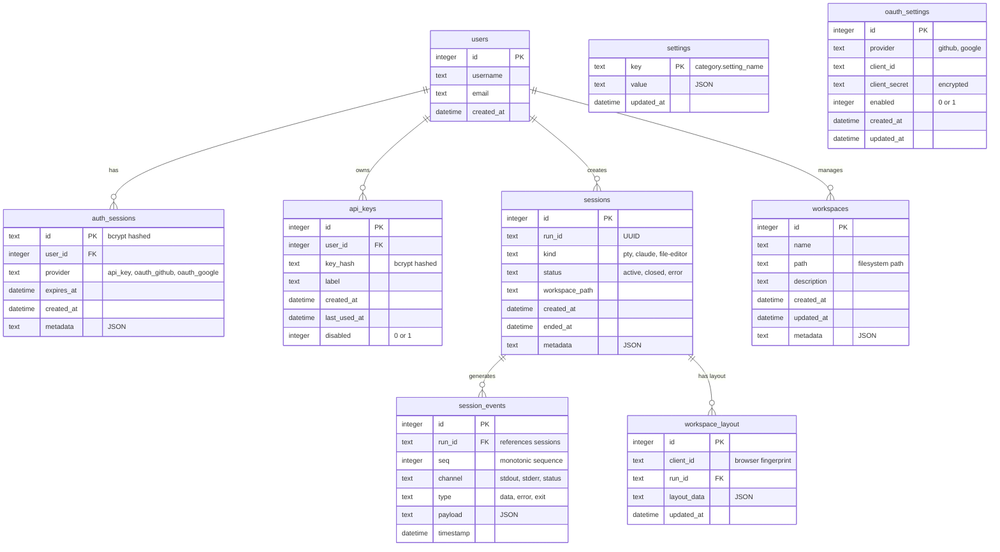

# Database Schema

This diagram shows the SQLite database structure supporting event-sourced sessions, authentication, workspace management, and application settings.



## Table Descriptions

### Core Tables

#### users
- **Purpose**: User accounts (typically single 'default' user)
- **Key Fields**: username, email
- **Indexes**: Primary key on id

#### sessions
- **Purpose**: Run session metadata
- **Key Fields**: run_id (UUID), kind (session type), status
- **Indexes**: Primary key on id, unique index on run_id
- **Session Types**: pty (terminal), claude (AI), file-editor
- **Statuses**: active, closed, error

#### session_events
- **Purpose**: Event sourcing log for all session activity
- **Key Fields**: run_id (foreign key), seq (monotonic), channel, type, payload
- **Indexes**: Composite index on (run_id, seq)
- **Event Structure**: All events logged with sequence numbers for replay
- **Channels**: stdout, stderr, status, custom
- **Retention**: Events persist for session lifetime

### Authentication Tables

#### auth_sessions
- **Purpose**: Browser session cookies
- **Key Fields**: id (bcrypt hashed), user_id, provider, expires_at
- **Security**: httpOnly, Secure in production, SameSite=Lax
- **Expiration**: 30 days with 24-hour refresh window
- **Providers**: api_key, oauth_github, oauth_google

#### api_keys
- **Purpose**: Programmatic access keys for CLI/scripts
- **Key Fields**: key_hash (bcrypt), label, last_used_at, disabled
- **Security**: Keys hashed with bcrypt (cost 12), never stored plaintext
- **Lifecycle**: Can be disabled (soft delete) or deleted (hard delete)
- **Metadata**: Custom labels, creation timestamp, usage tracking

#### oauth_settings
- **Purpose**: OAuth provider configuration
- **Key Fields**: provider, client_id, client_secret (encrypted), enabled
- **Providers**: GitHub, Google (extensible)
- **Security**: Client secrets encrypted at rest

### Workspace Tables

#### workspaces
- **Purpose**: Project workspace metadata
- **Key Fields**: name, path (filesystem), description
- **Metadata**: JSON field for extensibility
- **Relationships**: Sessions associated via workspace_path

#### workspace_layout
- **Purpose**: Per-client UI layout persistence
- **Key Fields**: client_id, run_id, layout_data (JSON)
- **Scope**: Client-specific (supports multi-tab layouts)
- **Updates**: Real-time updates as user rearranges UI

### Configuration Tables

#### settings
- **Purpose**: Application-wide configuration
- **Key Fields**: key (category.name), value (JSON)
- **Categories**: theme, terminal, security, features
- **Storage**: Flexible JSON values for complex settings

## Query Patterns

### Session Event Replay
```sql
SELECT * FROM session_events
WHERE run_id = ? AND seq > ?
ORDER BY seq ASC
```

### Active Sessions for User
```sql
SELECT * FROM sessions
WHERE status = 'active'
AND created_at > datetime('now', '-24 hours')
```

### Expired Session Cleanup
```sql
DELETE FROM auth_sessions
WHERE expires_at < datetime('now')
```

### Session Events with Metadata
```sql
SELECT s.*, COUNT(e.id) as event_count
FROM sessions s
LEFT JOIN session_events e ON s.run_id = e.run_id
WHERE s.status = 'active'
GROUP BY s.id
```

## Indexes for Performance

### Critical Indexes
- `sessions.run_id` (unique) - Fast session lookup
- `session_events.(run_id, seq)` (composite) - Ordered event replay
- `auth_sessions.expires_at` - Efficient expiration cleanup
- `api_keys.(user_id, disabled)` - Active key lookup

### Optional Indexes
- `sessions.(status, created_at)` - Dashboard queries
- `session_events.timestamp` - Time-based analysis
- `workspace_layout.client_id` - Layout retrieval

## Data Lifecycle

### Session Lifecycle
1. **Creation**: Record inserted in `sessions` table
2. **Activity**: Events appended to `session_events` (monotonic seq)
3. **Termination**: Status updated to 'closed' or 'error'
4. **Retention**: Events retained for debugging/audit (configurable)

### Auth Session Lifecycle
1. **Login**: Session created with 30-day expiration
2. **Activity**: Last-used timestamp updated (optional)
3. **Refresh**: Expiration extended if within 24h window
4. **Logout**: Session deleted immediately
5. **Cleanup**: Background job removes expired sessions

### API Key Lifecycle
1. **Creation**: Key generated, hashed, stored
2. **Usage**: last_used_at updated on each authentication
3. **Disable**: Soft delete via disabled flag
4. **Delete**: Hard delete removes record permanently

## Migration Strategy

Database migrations handled via:
- SQL migration files in `migrations/` directory
- Version tracking in `schema_version` table
- Forward-only migrations (no rollbacks)
- Automatic execution on startup

## Backup and Recovery

Recommended practices:
- Regular SQLite backups via `.backup` command
- Transaction logs for point-in-time recovery
- Export critical data (sessions, events) to external storage
- Test restore procedures regularly
