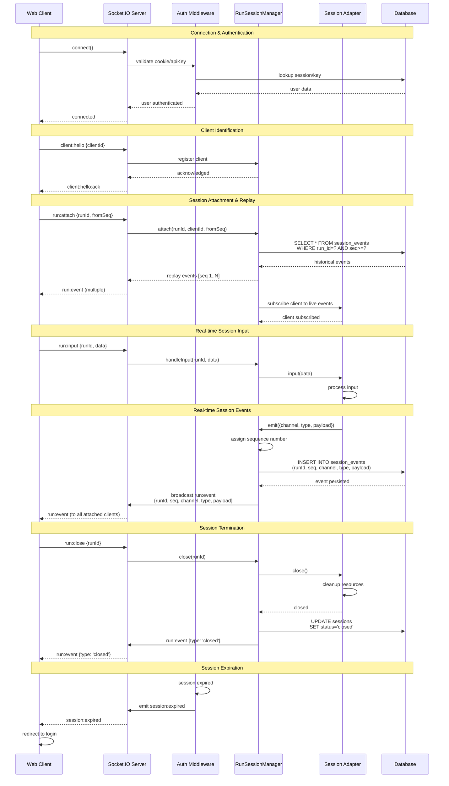
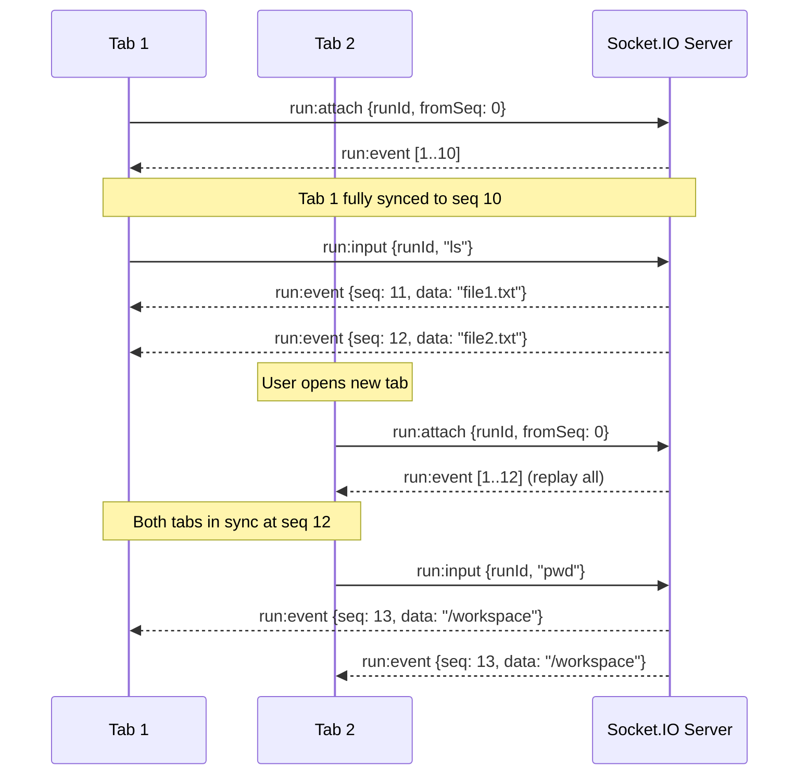
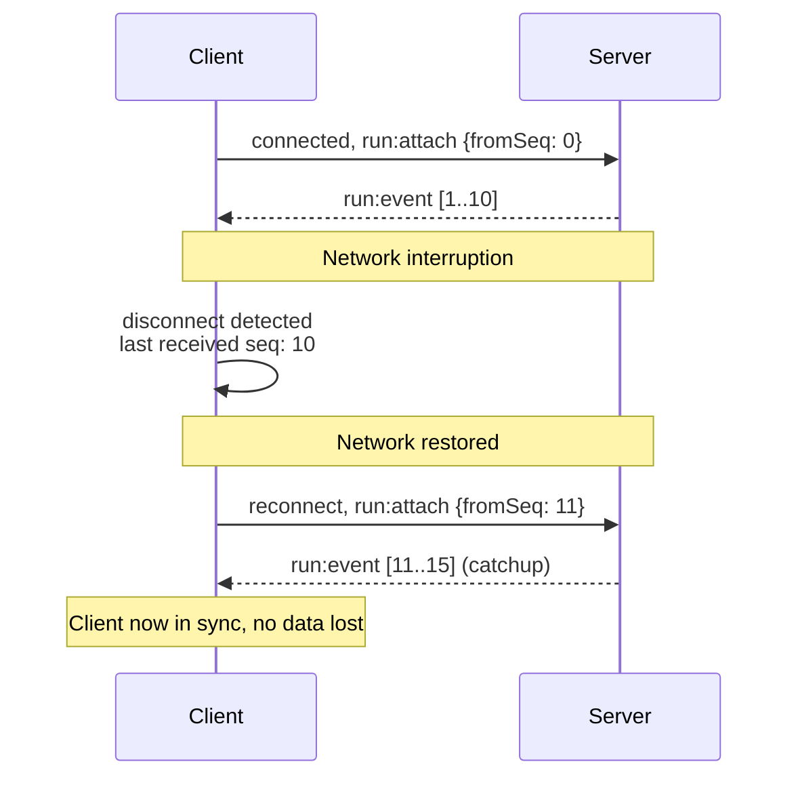

# Socket.IO Event Flow

This diagram illustrates the real-time bidirectional communication protocol between clients and server using Socket.IO, including authentication, session attachment, and event streaming.



## Event Protocol

### Client → Server Events

#### client:hello
```javascript
{
  clientId: "browser-fingerprint-uuid"
}
```
- **Purpose**: Identify client for multi-tab support
- **Response**: `client:hello:ack`
- **Required**: First event after connection

#### run:attach
```javascript
{
  runId: "session-uuid",
  fromSeq: 0  // sequence number to start replay from
}
```
- **Purpose**: Attach to existing session and replay missed events
- **Response**: Multiple `run:event` messages (historical) followed by live stream
- **Replay**: Events sent in order from `fromSeq` to current
- **Use Cases**: Initial load, reconnect after disconnect, multi-tab sync

#### run:input
```javascript
{
  runId: "session-uuid",
  data: "user input string"
}
```
- **Purpose**: Send user input to session (keystrokes, commands, etc.)
- **Target**: Routed to appropriate adapter based on session type
- **No Response**: Events generated by adapter as result of input

#### run:close
```javascript
{
  runId: "session-uuid"
}
```
- **Purpose**: Terminate session
- **Effect**: Adapter cleanup, database update, final events emitted
- **Response**: `run:event` with type 'closed'

### Server → Client Events

#### run:event
```javascript
{
  runId: "session-uuid",
  seq: 42,  // monotonic sequence number
  channel: "stdout",  // stdout, stderr, status, custom
  type: "data",       // channel-specific event type
  payload: {          // event-specific data
    text: "output text"
  },
  timestamp: "2024-01-15T10:30:00Z"
}
```
- **Purpose**: Stream session activity to clients
- **Guarantee**: Events delivered in sequence order
- **Persistence**: All events logged to database
- **Channels**:
  - `stdout`: Standard output data
  - `stderr`: Error output data
  - `status`: Session lifecycle events (started, closed, error)
  - Custom channels per adapter

#### session:expired
```javascript
{
  message: "Your session has expired. Please log in again."
}
```
- **Purpose**: Notify client of authentication expiration
- **Action**: Client should redirect to login page
- **Trigger**: Session timeout, logout from another tab, key disabled

## Multi-Client Synchronization

### Scenario: Multiple Tabs Viewing Same Session



### Reconnection After Network Failure



## Event Channels

### stdout Channel
```javascript
{
  channel: "stdout",
  type: "data",
  payload: {
    text: "command output"
  }
}
```

### stderr Channel
```javascript
{
  channel: "stderr",
  type: "error",
  payload: {
    text: "error message"
  }
}
```

### status Channel
```javascript
{
  channel: "status",
  type: "started",
  payload: {
    sessionType: "pty",
    metadata: {...}
  }
}

{
  channel: "status",
  type: "closed",
  payload: {
    exitCode: 0,
    reason: "user_requested"
  }
}
```

### Custom Channels (Adapter-specific)
```javascript
// Claude adapter example
{
  channel: "claude",
  type: "thinking",
  payload: {
    content: "analyzing code..."
  }
}

// File editor example
{
  channel: "file",
  type: "saved",
  payload: {
    path: "/workspace/file.txt",
    size: 1024
  }
}
```

## Error Handling

### Connection Errors
- **Retry Logic**: Exponential backoff (1s, 2s, 4s, 8s, max 30s)
- **User Notification**: Toast/banner showing connection status
- **State Preservation**: Client maintains last sequence number for resume

### Authentication Errors
- **Invalid Credentials**: Close connection, redirect to login
- **Session Expired**: Emit `session:expired`, redirect to login
- **Rate Limiting**: Temporary connection block with retry-after

### Session Errors
- **Session Not Found**: Return error event, close socket
- **Adapter Crash**: Emit error event, mark session as error state
- **Database Error**: Log error, attempt retry, fallback to error state

## Performance Considerations

### Event Batching
- Events emitted individually for real-time feel
- Database writes can be batched for performance (configurable)
- Large payloads (>1MB) should use alternative transfer method

### Scalability
- Each Socket.IO connection is lightweight
- Sessions isolated (no shared state between sessions)
- Database connection pooling for concurrent access
- Horizontal scaling possible with Redis adapter (future)

### Monitoring
- Track event counts per session
- Monitor sequence number gaps (data loss detection)
- Alert on high latency between event generation and delivery
