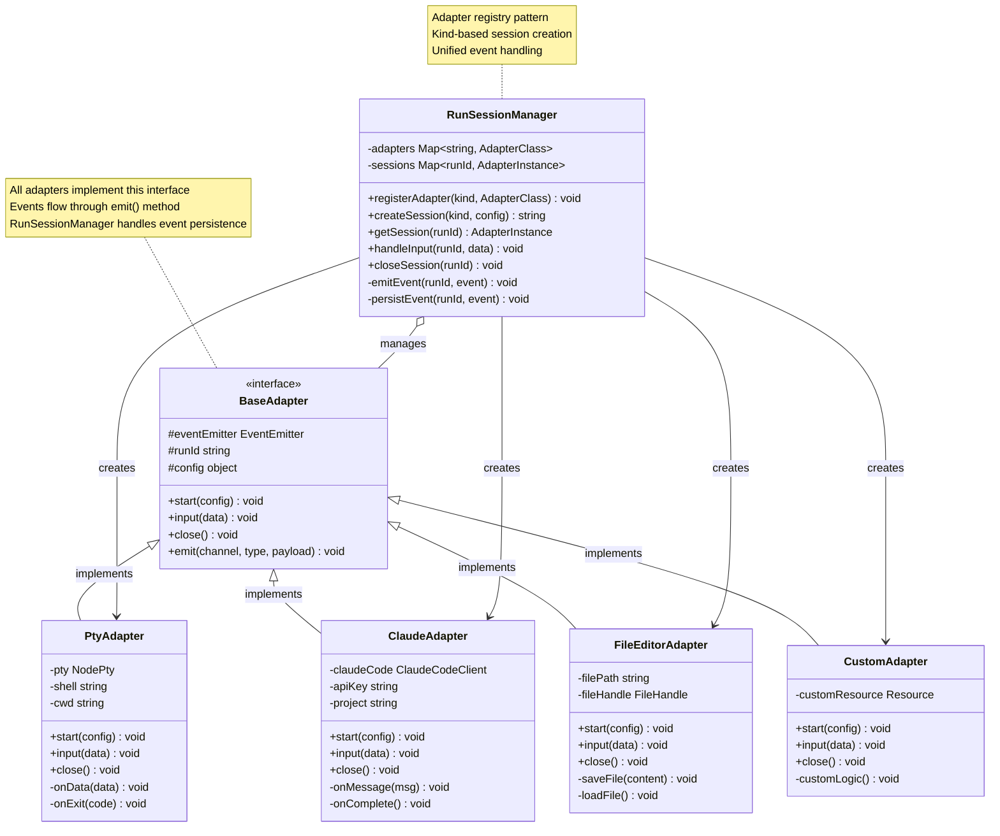

# Session Adapter Pattern

This diagram shows how the adapter pattern enables extensible session types with a unified interface, allowing new session capabilities to be added without modifying the core RunSessionManager.



## Adapter Interface Contract

### Required Methods

#### start(config)
```javascript
/**
 * Initialize the session with provided configuration
 * @param {Object} config - Session configuration
 * @param {string} config.workspacePath - Workspace directory
 * @param {Object} config.metadata - Adapter-specific settings
 */
async start(config) {
  // 1. Initialize external resource (PTY, API client, file handle)
  // 2. Set up event handlers
  // 3. Emit 'started' status event
  this.emit('status', 'started', { metadata });
}
```

#### input(data)
```javascript
/**
 * Process input from client
 * @param {string} data - User input to process
 */
input(data) {
  // 1. Validate input
  // 2. Send to external resource
  // 3. Let external resource emit events as result
}
```

#### close()
```javascript
/**
 * Clean up and terminate session
 */
async close() {
  // 1. Clean up external resource (kill process, close connection)
  // 2. Remove event listeners
  // 3. Emit 'closed' status event
  this.emit('status', 'closed', { reason: 'user_requested' });
}
```

#### emit(channel, type, payload)
```javascript
/**
 * Emit event to be logged and broadcast
 * @param {string} channel - Event channel (stdout, stderr, status, custom)
 * @param {string} type - Event type within channel
 * @param {Object} payload - Event data
 */
emit(channel, type, payload) {
  this.eventEmitter.emit('event', {
    runId: this.runId,
    channel,
    type,
    payload
  });
}
```

## Implementation Examples

### PtyAdapter - Terminal Sessions

```javascript
class PtyAdapter extends BaseAdapter {
  async start(config) {
    const { workspacePath, shell = '/bin/bash' } = config;

    // Spawn PTY process
    this.pty = spawn(shell, [], {
      cwd: workspacePath,
      env: process.env
    });

    // Forward PTY output as events
    this.pty.onData(data => {
      this.emit('stdout', 'data', { text: data });
    });

    this.pty.onExit(({ exitCode }) => {
      this.emit('status', 'exit', { exitCode });
    });

    this.emit('status', 'started', { shell, cwd: workspacePath });
  }

  input(data) {
    this.pty.write(data);
  }

  async close() {
    this.pty.kill();
    this.emit('status', 'closed', { reason: 'user_requested' });
  }
}
```

### ClaudeAdapter - AI Sessions

```javascript
class ClaudeAdapter extends BaseAdapter {
  async start(config) {
    const { apiKey, project, workspacePath } = config;

    // Initialize Claude Code client
    this.claudeCode = new ClaudeCode({
      apiKey,
      project,
      workingDirectory: workspacePath
    });

    // Forward Claude messages as events
    this.claudeCode.on('message', msg => {
      this.emit('claude', 'message', { content: msg });
    });

    this.claudeCode.on('thinking', thought => {
      this.emit('claude', 'thinking', { content: thought });
    });

    this.emit('status', 'started', { project });
  }

  input(data) {
    this.claudeCode.sendMessage(data);
  }

  async close() {
    await this.claudeCode.disconnect();
    this.emit('status', 'closed', { reason: 'user_requested' });
  }
}
```

### FileEditorAdapter - File Sessions

```javascript
class FileEditorAdapter extends BaseAdapter {
  async start(config) {
    const { filePath, workspacePath } = config;

    this.filePath = path.join(workspacePath, filePath);

    // Load file content
    const content = await fs.readFile(this.filePath, 'utf-8');

    this.emit('file', 'loaded', {
      path: filePath,
      content,
      size: content.length
    });

    this.emit('status', 'started', { filePath });
  }

  async input(data) {
    const { action, content } = JSON.parse(data);

    if (action === 'save') {
      await fs.writeFile(this.filePath, content);
      this.emit('file', 'saved', {
        path: this.filePath,
        size: content.length
      });
    }
  }

  async close() {
    this.emit('status', 'closed', { reason: 'user_requested' });
  }
}
```

## Registration and Usage

### Adapter Registration
```javascript
// In src/lib/server/shared/index.js
import { PtyAdapter } from '../terminal/PtyAdapter.js';
import { ClaudeAdapter } from '../claude/ClaudeAdapter.js';
import { FileEditorAdapter } from '../file-editor/FileEditorAdapter.js';

// Register all adapters at startup
RunSessionManager.registerAdapter('pty', PtyAdapter);
RunSessionManager.registerAdapter('claude', ClaudeAdapter);
RunSessionManager.registerAdapter('file-editor', FileEditorAdapter);
```

### Creating Sessions
```javascript
// Client requests session creation
const response = await fetch('/api/sessions', {
  method: 'POST',
  body: JSON.stringify({
    type: 'pty',  // adapter kind
    workspacePath: '/workspace/my-project',
    metadata: {
      shell: '/bin/bash',
      env: { CUSTOM_VAR: 'value' }
    }
  })
});

// RunSessionManager creates session
const runId = RunSessionManager.createSession('pty', {
  workspacePath: '/workspace/my-project',
  metadata: { shell: '/bin/bash' }
});

// Adapter instantiated, start() called, events begin flowing
```

## Adding a New Adapter

### Step 1: Create Adapter Class
```javascript
// src/lib/server/my-feature/MyAdapter.js
import { BaseAdapter } from '../shared/BaseAdapter.js';

export class MyAdapter extends BaseAdapter {
  async start(config) {
    // Initialize your resource
    this.emit('status', 'started', {});
  }

  input(data) {
    // Handle input
  }

  async close() {
    // Cleanup
    this.emit('status', 'closed', {});
  }
}
```

### Step 2: Register Adapter
```javascript
// src/lib/server/shared/index.js
import { MyAdapter } from '../my-feature/MyAdapter.js';

RunSessionManager.registerAdapter('my-feature', MyAdapter);
```

### Step 3: Add Session Type Constant
```javascript
// src/lib/shared/session-types.js
export const SESSION_TYPES = {
  PTY: 'pty',
  CLAUDE: 'claude',
  FILE_EDITOR: 'file-editor',
  MY_FEATURE: 'my-feature'  // Add here
};
```

### Step 4: Create UI Components
```javascript
// src/lib/client/my-feature/MyFeaturePane.svelte
<script>
  import { sessionViewModel } from '$lib/client/shared/state/SessionViewModel.svelte.js';

  export let session;

  // Handle events from adapter
  $effect(() => {
    if (session.events) {
      // Process events
    }
  });
</script>

<div class="my-feature-pane">
  <!-- Your UI -->
</div>
```

### Step 5: Register Session Module
```javascript
// src/lib/client/shared/session-modules/index.js
import MyFeaturePane from '../../my-feature/MyFeaturePane.svelte';
import MyFeatureHeader from '../../my-feature/MyFeatureHeader.svelte';

export const sessionModules = {
  'my-feature': {
    pane: MyFeaturePane,
    header: MyFeatureHeader
  }
};
```

## Benefits of Adapter Pattern

### Extensibility
- New session types added without modifying core
- Each adapter encapsulates its own complexity
- Core logic remains stable as features grow

### Testability
- Adapters tested in isolation
- Mock adapters for integration tests
- Event-based interface easy to verify

### Maintainability
- Clear boundaries between session types
- Changes to one adapter don't affect others
- Consistent interface across all types

### Flexibility
- Different external resources (processes, APIs, files)
- Custom event channels per adapter type
- Adapter-specific configuration and metadata
