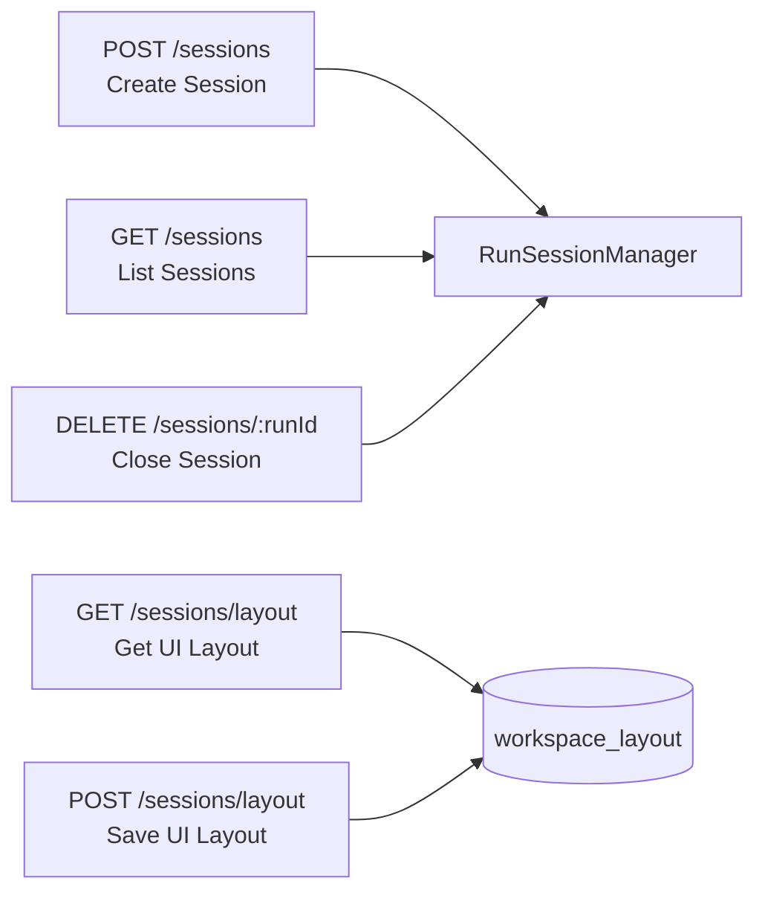
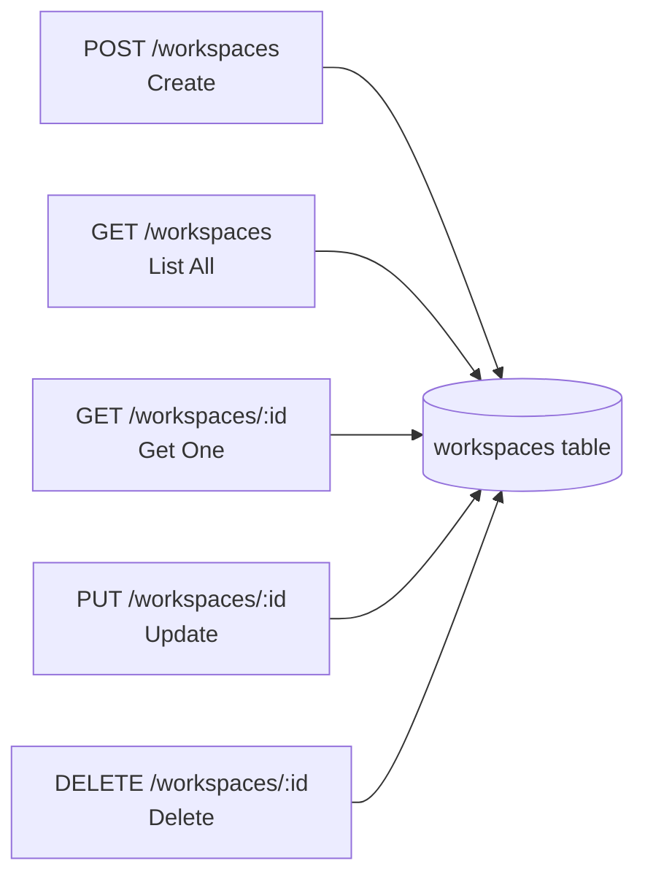
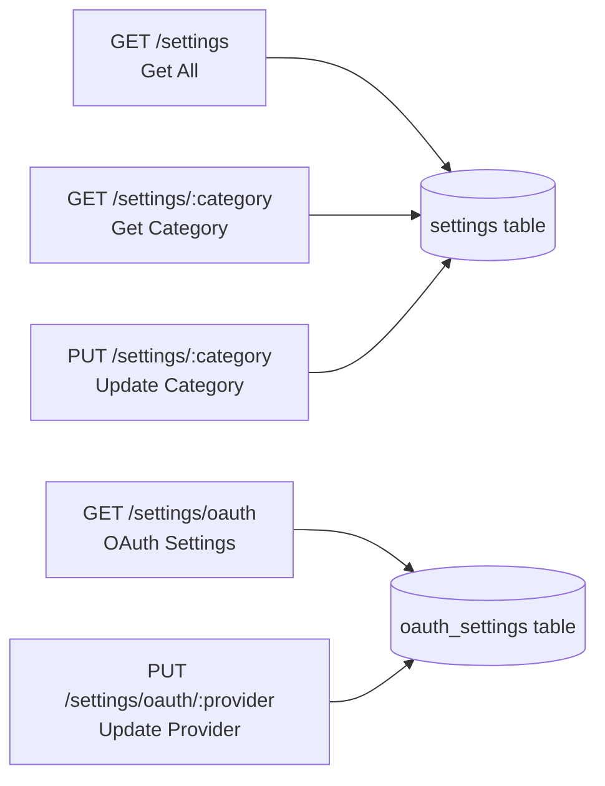
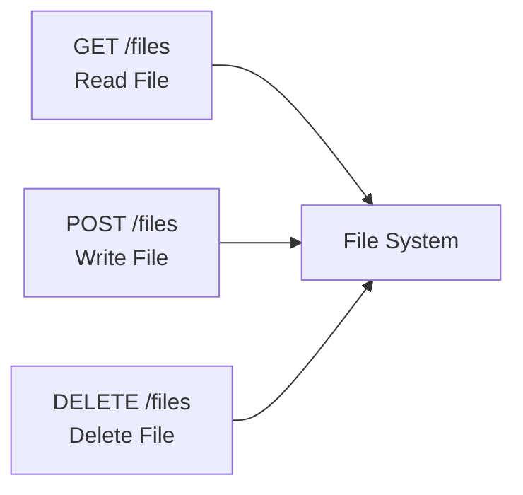
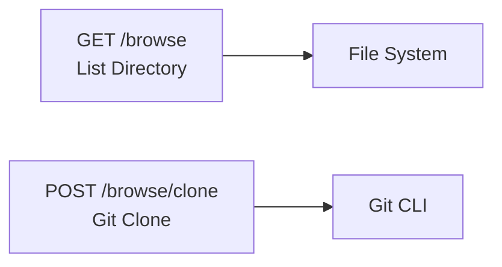
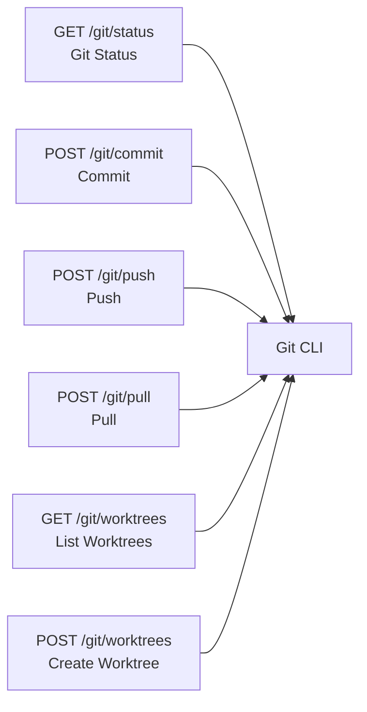
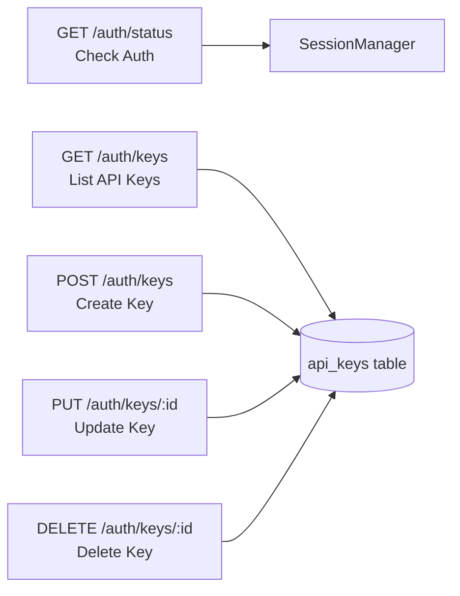
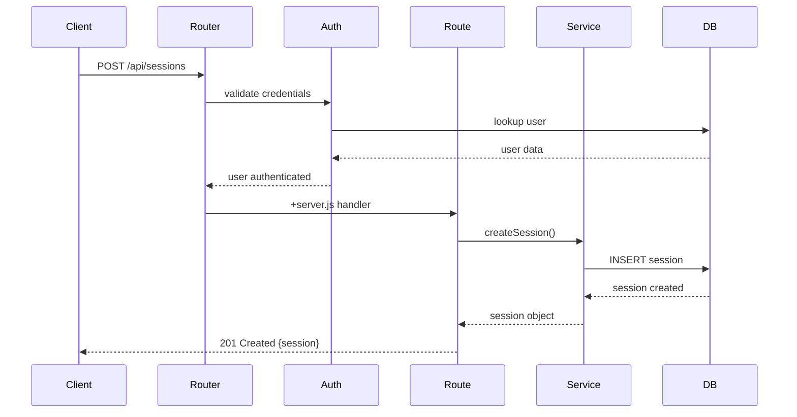
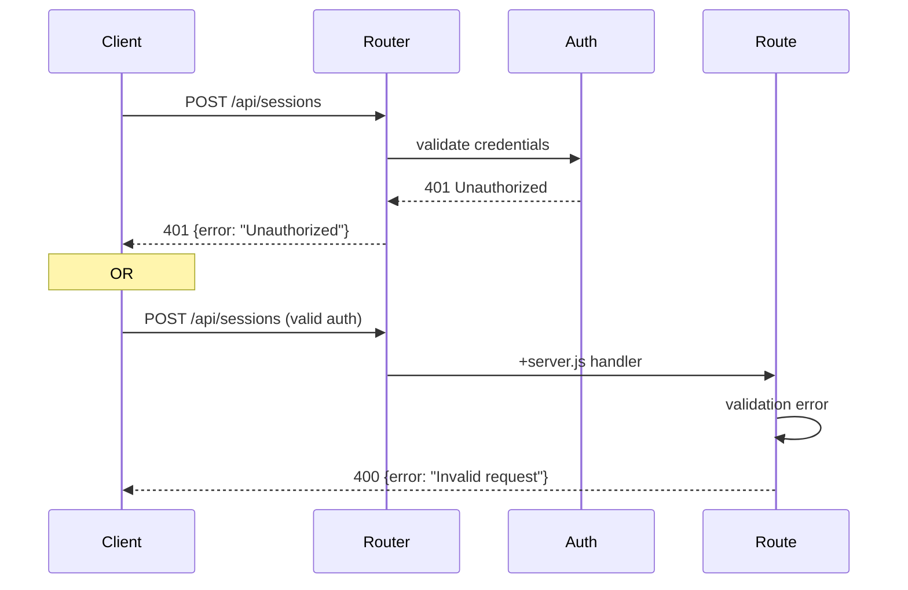

# API Routes Structure

This diagram shows the RESTful API architecture, route organization, and request/response flow through the SvelteKit backend.

```mermaid
graph TB
    subgraph "Client Layer"
        Browser[Web Browser]
        CLI[CLI/Scripts]
    end

    subgraph "API Gateway"
        Router[SvelteKit Router<br/>src/routes/api/]
        AuthMiddleware[Authentication<br/>hooks.server.js]
    end

    subgraph "API Route Groups"
        Sessions[/api/sessions<br/>Session Management]
        Workspaces[/api/workspaces<br/>Workspace CRUD]
        Settings[/api/settings<br/>Configuration]
        Files[/api/files<br/>File Operations]
        Browse[/api/browse<br/>Directory Browsing]
        Git[/api/git<br/>Git Operations]
        Claude[/api/claude<br/>Claude Integration]
        Themes[/api/themes<br/>Theme Management]
        Admin[/api/admin<br/>Monitoring]
        Auth[/api/auth<br/>Authentication]
    end

    subgraph "Service Layer"
        RunSessionMgr[RunSessionManager]
        WorkspaceService[WorkspaceService]
        SettingsService[SettingsService]
        GitService[GitService]
        FileService[FileService]
        AuthService[AuthService]
    end

    subgraph "Data Layer"
        DB[(SQLite Database)]
        FS[File System]
    end

    Browser -->|Cookie Auth| Router
    CLI -->|Bearer Token| Router

    Router --> AuthMiddleware
    AuthMiddleware --> Sessions
    AuthMiddleware --> Workspaces
    AuthMiddleware --> Settings
    AuthMiddleware --> Files
    AuthMiddleware --> Browse
    AuthMiddleware --> Git
    AuthMiddleware --> Claude
    AuthMiddleware --> Themes
    AuthMiddleware --> Admin
    AuthMiddleware --> Auth

    Sessions --> RunSessionMgr
    Workspaces --> WorkspaceService
    Settings --> SettingsService
    Files --> FileService
    Browse --> FileService
    Git --> GitService
    Claude --> RunSessionMgr
    Themes --> SettingsService
    Admin --> RunSessionMgr
    Auth --> AuthService

    RunSessionMgr --> DB
    WorkspaceService --> DB
    SettingsService --> DB
    AuthService --> DB
    FileService --> FS
    GitService --> FS

    style Router fill:#e7f3ff
    style AuthMiddleware fill:#fff3cd
    style DB fill:#d4edda
```

## Route Groups

### Session Management (/api/sessions)



**Endpoints:**
- `POST /api/sessions` - Create new session (pty, claude, file-editor)
- `GET /api/sessions` - List all active sessions
- `GET /api/sessions/:runId` - Get session details
- `DELETE /api/sessions/:runId` - Close session
- `GET /api/sessions/layout` - Get client-specific layout
- `POST /api/sessions/layout` - Save client-specific layout

**Request Body (POST):**
```json
{
  "type": "pty",
  "workspacePath": "/workspace/project",
  "metadata": {
    "shell": "/bin/bash",
    "env": {}
  }
}
```

### Workspace Management (/api/workspaces)



**Endpoints:**
- `POST /api/workspaces` - Create workspace
- `GET /api/workspaces` - List all workspaces
- `GET /api/workspaces/:id` - Get workspace by ID
- `PUT /api/workspaces/:id` - Update workspace
- `DELETE /api/workspaces/:id` - Delete workspace

**Request Body (POST/PUT):**
```json
{
  "name": "My Project",
  "path": "/workspace/my-project",
  "description": "Project description",
  "metadata": {}
}
```

### Settings Management (/api/settings)



**Endpoints:**
- `GET /api/settings` - Get all settings
- `GET /api/settings/:category` - Get category settings (theme, terminal, security)
- `PUT /api/settings/:category` - Update category settings
- `GET /api/settings/oauth` - Get OAuth provider configurations
- `PUT /api/settings/oauth/:provider` - Update OAuth provider

**Categories:**
- `theme` - UI theme settings
- `terminal` - Terminal emulator configuration
- `security` - Security policies
- `features` - Feature flags

### File Operations (/api/files)



**Endpoints:**
- `GET /api/files?path=/workspace/file.txt` - Read file
- `POST /api/files` - Write/create file
- `DELETE /api/files?path=/workspace/file.txt` - Delete file

**Request Body (POST):**
```json
{
  "path": "/workspace/file.txt",
  "content": "file contents",
  "encoding": "utf-8"
}
```

### Directory Browsing (/api/browse)



**Endpoints:**
- `GET /api/browse?path=/workspace` - List directory contents
- `POST /api/browse/clone` - Clone git repository

### Git Operations (/api/git)



**Endpoints:**
- `GET /api/git/status?path=/workspace/project` - Git status
- `POST /api/git/commit` - Commit changes
- `POST /api/git/push` - Push to remote
- `POST /api/git/pull` - Pull from remote
- `GET /api/git/worktrees` - List git worktrees
- `POST /api/git/worktrees` - Create worktree

### Claude Integration (/api/claude)

```mermaid
graph LR
    GET[GET /claude/projects<br/>List Projects] --> Claude_SDK
    POST[POST /claude/auth<br/>Authenticate] --> Claude_SDK

    Claude_SDK[@anthropic-ai/claude-code]
```

**Endpoints:**
- `GET /api/claude/projects` - List available Claude projects
- `POST /api/claude/auth` - Authenticate Claude API key

### Authentication (/api/auth)



**Endpoints:**
- `GET /api/auth/status` - Check authentication status
- `GET /api/auth/keys` - List user's API keys
- `POST /api/auth/keys` - Create new API key
- `PUT /api/auth/keys/:id` - Update API key (disable/enable)
- `DELETE /api/auth/keys/:id` - Delete API key

## Request/Response Flow

### Successful Request



### Error Handling



## Authentication Flow

### Cookie-Based (Browser)

```javascript
// Request includes httpOnly cookie
GET /api/sessions
Cookie: session=abc123...

// Middleware validates
const session = await validateSessionCookie(request);
event.locals.user = session.user;

// Route has access to user
export async function GET({ locals }) {
  const user = locals.user; // authenticated user
}
```

### API Key (CLI/Scripts)

```javascript
// Request includes Authorization header
GET /api/sessions
Authorization: Bearer sk_live_abc123...

// Middleware validates
const apiKey = await validateApiKey(request);
event.locals.user = apiKey.user;

// Route has access to user
export async function GET({ locals }) {
  const user = locals.user; // authenticated user
}
```

## Response Formats

### Success Response
```json
{
  "data": {
    "id": "123",
    "runId": "uuid",
    "status": "active"
  },
  "metadata": {
    "timestamp": "2024-01-15T10:30:00Z"
  }
}
```

### Error Response
```json
{
  "error": {
    "code": "VALIDATION_ERROR",
    "message": "Invalid session type",
    "details": {
      "field": "type",
      "allowed": ["pty", "claude", "file-editor"]
    }
  }
}
```

### List Response
```json
{
  "data": [...],
  "pagination": {
    "total": 100,
    "page": 1,
    "pageSize": 20
  }
}
```

## Best Practices

### Route Organization
- Group related endpoints under common prefix
- Use RESTful conventions (GET, POST, PUT, DELETE)
- Version API with /api/v1 if needed in future

### Error Handling
- Use standard HTTP status codes
- Return consistent error format
- Include helpful error messages
- Log errors for debugging

### Validation
- Validate request body with Zod or similar
- Sanitize user input
- Check permissions before operations
- Return 400 for validation errors

### Performance
- Use database indexes for common queries
- Implement pagination for large lists
- Cache frequently accessed data
- Use streaming for large file transfers
