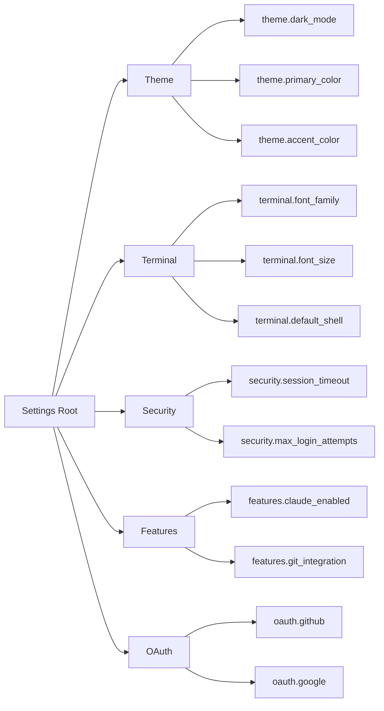
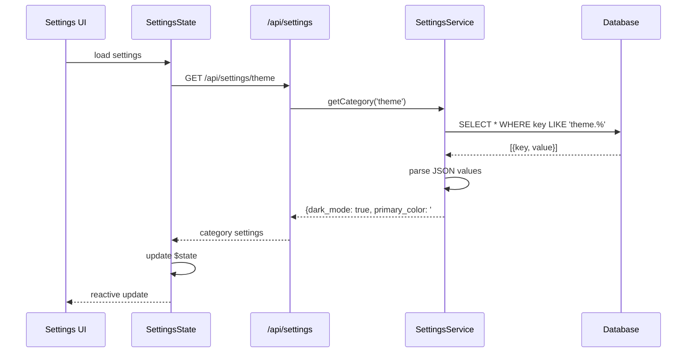
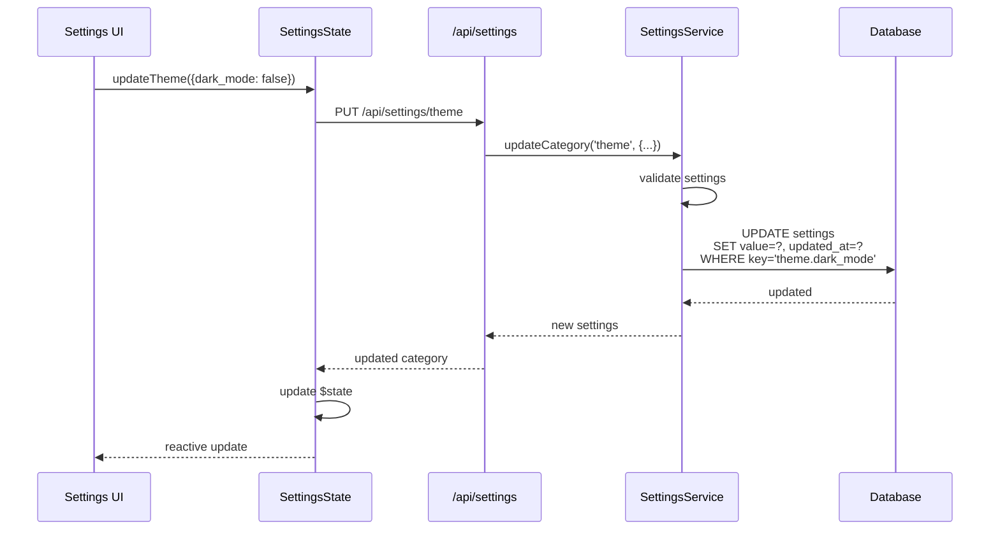

# Settings System

This diagram illustrates the hierarchical settings management system with category-based organization, database persistence, and real-time UI synchronization.

```mermaid
graph TB
    subgraph "Client Layer"
        SettingsUI[Settings UI<br/>/settings]
        ThemePicker[Theme Picker]
        TerminalConfig[Terminal Config]
        SecuritySettings[Security Settings]
        OAuthConfig[OAuth Config]
    end

    subgraph "State Management"
        UIState[UIState.svelte.js<br/>$state theme, layout]
        SettingsState[SettingsState.svelte.js<br/>$state settings]
    end

    subgraph "API Layer"
        SettingsAPI[/api/settings<br/>REST Endpoints]
        CategoryAPI[/api/settings/:category<br/>Category CRUD]
        OAuthAPI[/api/settings/oauth<br/>OAuth Config]
    end

    subgraph "Service Layer"
        SettingsService[SettingsService<br/>Business Logic]
        SettingsManager[SettingsManager<br/>Database Operations]
    end

    subgraph "Storage"
        SettingsDB[(settings table<br/>key-value store)]
        OAuthDB[(oauth_settings table<br/>provider config)]
    end

    subgraph "Settings Categories"
        Theme[theme<br/>colors, mode]
        Terminal[terminal<br/>font, shell]
        Security[security<br/>policies]
        Features[features<br/>flags]
    end

    SettingsUI --> UIState
    ThemePicker --> UIState
    TerminalConfig --> SettingsState
    SecuritySettings --> SettingsState
    OAuthConfig --> SettingsState

    UIState --> SettingsAPI
    SettingsState --> CategoryAPI
    SettingsState --> OAuthAPI

    SettingsAPI --> SettingsService
    CategoryAPI --> SettingsService
    OAuthAPI --> SettingsService

    SettingsService --> SettingsManager

    SettingsManager --> SettingsDB
    SettingsManager --> OAuthDB

    SettingsDB --> Theme
    SettingsDB --> Terminal
    SettingsDB --> Security
    SettingsDB --> Features

    style UIState fill:#fff3cd
    style SettingsState fill:#fff3cd
    style SettingsDB fill:#d4edda
```

## Settings Architecture

### Category-Based Organization

Settings are organized into logical categories:



### Database Schema

#### settings table
```sql
CREATE TABLE settings (
  key TEXT PRIMARY KEY,      -- "category.setting_name"
  value TEXT NOT NULL,       -- JSON-encoded value
  updated_at DATETIME
);

-- Examples:
-- key: "theme.dark_mode", value: "true"
-- key: "terminal.font_size", value: "14"
-- key: "features.claude_enabled", value: "true"
```

#### oauth_settings table
```sql
CREATE TABLE oauth_settings (
  id INTEGER PRIMARY KEY,
  provider TEXT NOT NULL,    -- "github", "google"
  client_id TEXT,
  client_secret TEXT,        -- encrypted
  enabled INTEGER DEFAULT 0, -- 0 or 1
  created_at DATETIME,
  updated_at DATETIME
);
```

## Settings Flow

### Reading Settings



### Updating Settings



## Default Settings

### System Defaults
```javascript
const DEFAULT_SETTINGS = {
  theme: {
    dark_mode: true,
    primary_color: '#3b82f6',
    accent_color: '#8b5cf6',
    font_family: 'Inter, system-ui, sans-serif'
  },
  terminal: {
    font_family: 'JetBrains Mono, monospace',
    font_size: 14,
    line_height: 1.5,
    default_shell: '/bin/bash',
    cursor_style: 'block',
    cursor_blink: true
  },
  security: {
    session_timeout: 2592000000, // 30 days in ms
    session_refresh_window: 86400000, // 24 hours in ms
    max_login_attempts: 5,
    lockout_duration: 900000 // 15 minutes in ms
  },
  features: {
    claude_enabled: true,
    git_integration: true,
    file_editor_enabled: true,
    oauth_enabled: false,
    localtunnel_enabled: false
  }
};
```

### Initialization
```javascript
// On first startup or when settings missing
async function initializeSettings() {
  for (const [category, settings] of Object.entries(DEFAULT_SETTINGS)) {
    for (const [key, value] of Object.entries(settings)) {
      const settingKey = `${category}.${key}`;
      const exists = await db.get('SELECT 1 FROM settings WHERE key = ?', settingKey);

      if (!exists) {
        await db.run(
          'INSERT INTO settings (key, value, updated_at) VALUES (?, ?, ?)',
          settingKey,
          JSON.stringify(value),
          new Date().toISOString()
        );
      }
    }
  }
}
```

## Settings Validation

### Type Validation
```javascript
const SETTING_SCHEMAS = {
  'theme.dark_mode': z.boolean(),
  'theme.primary_color': z.string().regex(/^#[0-9a-f]{6}$/i),
  'terminal.font_size': z.number().min(8).max(32),
  'terminal.default_shell': z.string().min(1),
  'security.session_timeout': z.number().positive(),
  'features.claude_enabled': z.boolean()
};

function validateSetting(key, value) {
  const schema = SETTING_SCHEMAS[key];
  if (!schema) {
    throw new Error(`Unknown setting: ${key}`);
  }
  return schema.parse(value);
}
```

### Update Validation
```javascript
async function updateSetting(key, value) {
  // 1. Validate type
  const validatedValue = validateSetting(key, value);

  // 2. Check permissions
  if (requiresAdmin(key) && !isAdmin(user)) {
    throw new Error('Insufficient permissions');
  }

  // 3. Update database
  await db.run(
    'UPDATE settings SET value = ?, updated_at = ? WHERE key = ?',
    JSON.stringify(validatedValue),
    new Date().toISOString(),
    key
  );

  // 4. Apply changes
  applySettingChange(key, validatedValue);
}
```

## OAuth Settings

### Provider Configuration
```javascript
{
  provider: 'github',
  client_id: 'github_oauth_client_id',
  client_secret: '***encrypted***',
  enabled: true
}
```

### Security Measures
- Client secrets encrypted at rest using AES-256
- Secrets never sent to browser
- Provider enable/disable flag
- Separate table for sensitive OAuth data

### OAuth Lifecycle
1. **Configuration**: Admin sets up provider credentials via `/settings/oauth`
2. **Encryption**: Client secret encrypted before storage
3. **Enable**: Provider marked as enabled
4. **Login Flow**: Users can authenticate via OAuth provider
5. **Disable**: Provider disabled but existing sessions preserved
6. **Update**: Credentials can be updated with re-encryption

## Settings Migration

### Version Tracking
```javascript
const SETTINGS_VERSION = 3;

async function migrateSettings() {
  const version = await getCurrentVersion();

  if (version < 2) {
    await migrateV1toV2();
  }

  if (version < 3) {
    await migrateV2toV3();
  }

  await setCurrentVersion(SETTINGS_VERSION);
}
```

### Example Migration
```javascript
// Migration: Split theme into dark/light variants
async function migrateV2toV3() {
  const oldTheme = await getSetting('theme.colors');

  await setSetting('theme.dark_mode', true);
  await setSetting('theme.light.primary', oldTheme.light);
  await setSetting('theme.dark.primary', oldTheme.dark);

  await deleteSetting('theme.colors');
}
```

## Real-time Updates

### State Synchronization
```javascript
class SettingsState {
  settings = $state({});

  async load() {
    const response = await fetch('/api/settings');
    this.settings = await response.json();
  }

  async update(category, updates) {
    const response = await fetch(`/api/settings/${category}`, {
      method: 'PUT',
      body: JSON.stringify(updates)
    });

    const updated = await response.json();
    this.settings[category] = updated;
  }
}
```

### Multi-tab Synchronization
```javascript
// Use BroadcastChannel for cross-tab updates
const settingsChannel = new BroadcastChannel('settings');

settingsChannel.onmessage = (event) => {
  const { category, settings } = event.data;
  settingsState.settings[category] = settings;
};

// After updating settings
settingsChannel.postMessage({ category, settings });
```

## Settings UI Patterns

### Category Tabs
```svelte
<script>
  import { settingsState } from '$lib/client/shared/state/SettingsState.svelte.js';

  let activeCategory = $state('theme');
</script>

<div class="settings-tabs">
  <button onclick={() => activeCategory = 'theme'}>Theme</button>
  <button onclick={() => activeCategory = 'terminal'}>Terminal</button>
  <button onclick={() => activeCategory = 'security'}>Security</button>
</div>

{#if activeCategory === 'theme'}
  <ThemeSettings settings={settingsState.settings.theme} />
{:else if activeCategory === 'terminal'}
  <TerminalSettings settings={settingsState.settings.terminal} />
{/if}
```

### Auto-save on Change
```svelte
<script>
  import { settingsState } from '$lib/client/shared/state/SettingsState.svelte.js';

  let darkMode = $state(settingsState.settings.theme.dark_mode);

  // Auto-save on change
  $effect(() => {
    settingsState.update('theme', { dark_mode: darkMode });
  });
</script>

<label>
  <input type="checkbox" bind:checked={darkMode} />
  Dark Mode
</label>
```

## Performance Considerations

### Caching
- Settings cached in memory on server startup
- Client-side caching with reactive state
- Invalidate cache on updates

### Lazy Loading
- Load settings by category on demand
- Don't load all settings on app startup
- Prefetch commonly used categories

### Batch Updates
- Allow updating multiple settings in one request
- Reduce database writes
- Atomic category updates
