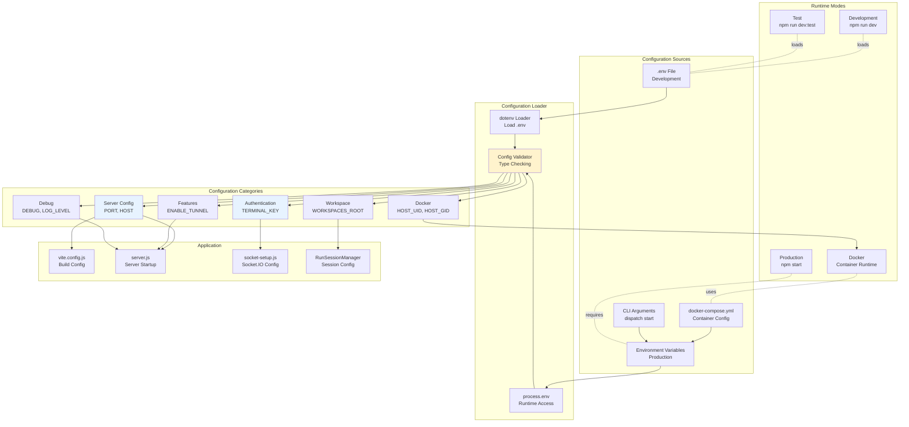
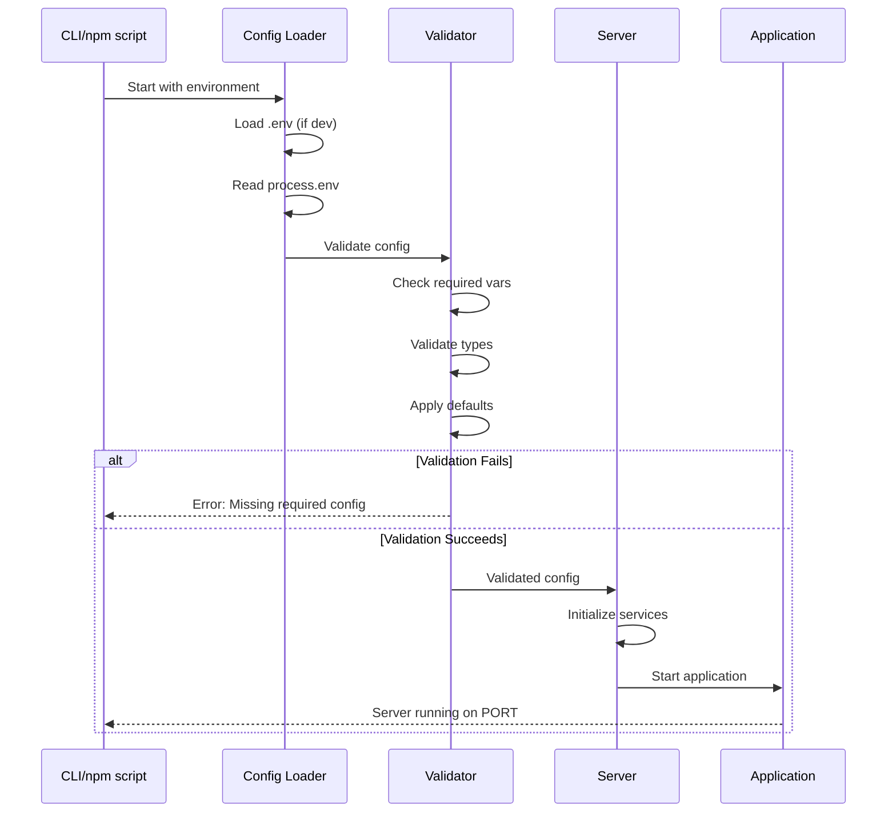

# Configuration System

This diagram shows the environment-based configuration system, including environment variables, runtime modes, and deployment configurations.



## Environment Variables

### Core Configuration

#### Server Configuration
```bash
# Server listening port
PORT=3030

# Server host (0.0.0.0 for all interfaces)
HOST=0.0.0.0

# Origin for CORS (production)
ORIGIN=https://dispatch.example.com
```

#### Authentication
```bash
# Required in production, optional in development
TERMINAL_KEY=your-secret-key-here

# Session configuration
SESSION_TIMEOUT=2592000000  # 30 days in milliseconds
SESSION_REFRESH_WINDOW=86400000  # 24 hours in milliseconds
```

#### Workspace Configuration
```bash
# Root directory for all workspaces
WORKSPACES_ROOT=/workspace

# Default workspace name
DEFAULT_WORKSPACE=default

# Home directory simulation
HOME_DIR=/home/dispatch
```

#### Feature Flags
```bash
# Enable LocalTunnel for public URL
ENABLE_TUNNEL=false

# Enable OAuth authentication
ENABLE_OAUTH=false

# Enable Claude Code integration
ENABLE_CLAUDE=true

# Enable Git integration
ENABLE_GIT=true
```

#### Docker Configuration
```bash
# User ID mapping for file permissions
HOST_UID=1000

# Group ID mapping for file permissions
HOST_GID=1000

# Docker socket path (for Docker-in-Docker)
DOCKER_SOCKET=/var/run/docker.sock
```

#### Debug Configuration
```bash
# Debug logging (use * for all, or specific modules)
DEBUG=*
DEBUG=dispatch:*
DEBUG=dispatch:sessions,dispatch:auth

# Log level (error, warn, info, debug, trace)
LOG_LEVEL=info
```

### Development Modes

#### Standard Development
```bash
# npm run dev
NODE_ENV=development
PORT=5173
TERMINAL_KEY=testkey12345
WORKSPACES_ROOT=./.testing-home/workspaces
SSL_ENABLED=true
```

#### Test Server
```bash
# npm run dev:test
NODE_ENV=test
PORT=7173
TERMINAL_KEY=test-automation-key-12345
WORKSPACES_ROOT=/tmp/dispatch-test-workspaces
SSL_ENABLED=false
```

#### Local Development
```bash
# npm run dev:local
NODE_ENV=development
WORKSPACES_ROOT=$HOME/code
USE_LOCAL_WORKSPACE=true
```

#### Tunnel Mode
```bash
# npm run dev:tunnel
ENABLE_TUNNEL=true
TUNNEL_SUBDOMAIN=my-dispatch
```

## Configuration Flow

### Startup Sequence



### Configuration Validation

```javascript
// src/lib/server/config.js
import { z } from 'zod';

const ConfigSchema = z.object({
  // Server
  PORT: z.coerce.number().default(3030),
  HOST: z.string().default('0.0.0.0'),
  ORIGIN: z.string().optional(),

  // Authentication
  TERMINAL_KEY: z.string().min(8).optional(),

  // Workspace
  WORKSPACES_ROOT: z.string().default('/workspace'),
  DEFAULT_WORKSPACE: z.string().default('default'),

  // Features
  ENABLE_TUNNEL: z.coerce.boolean().default(false),
  ENABLE_OAUTH: z.coerce.boolean().default(false),
  ENABLE_CLAUDE: z.coerce.boolean().default(true),

  // Docker
  HOST_UID: z.coerce.number().optional(),
  HOST_GID: z.coerce.number().optional(),

  // Debug
  DEBUG: z.string().optional(),
  LOG_LEVEL: z.enum(['error', 'warn', 'info', 'debug', 'trace']).default('info')
});

export function loadConfig() {
  try {
    const config = ConfigSchema.parse(process.env);

    // Production validation
    if (process.env.NODE_ENV === 'production') {
      if (!config.TERMINAL_KEY) {
        throw new Error('TERMINAL_KEY required in production');
      }
      if (!config.ORIGIN) {
        console.warn('ORIGIN not set, CORS disabled');
      }
    }

    return config;
  } catch (error) {
    console.error('Configuration validation failed:', error);
    process.exit(1);
  }
}
```

## Docker Configuration

### docker-compose.yml
```yaml
version: '3.8'

services:
  dispatch:
    build: .
    ports:
      - "${PORT:-3030}:3030"
    environment:
      - NODE_ENV=production
      - PORT=3030
      - HOST=0.0.0.0
      - TERMINAL_KEY=${TERMINAL_KEY}
      - WORKSPACES_ROOT=/workspace
      - HOST_UID=${HOST_UID:-1000}
      - HOST_GID=${HOST_GID:-1000}
      - ENABLE_TUNNEL=${ENABLE_TUNNEL:-false}
    volumes:
      - workspace-data:/workspace
      - dispatch-data:/home/dispatch/.dispatch
    user: "${HOST_UID:-1000}:${HOST_GID:-1000}"

volumes:
  workspace-data:
  dispatch-data:
```

### Dockerfile
```dockerfile
FROM node:22-alpine

# Install dependencies
RUN apk add --no-cache \
    git \
    bash \
    openssh-client

# Create non-root user
ARG HOST_UID=1000
ARG HOST_GID=1000
RUN addgroup -g ${HOST_GID} dispatch && \
    adduser -D -u ${HOST_UID} -G dispatch dispatch

# Set working directory
WORKDIR /app

# Copy package files
COPY package*.json ./

# Install production dependencies
RUN npm ci --omit=dev

# Copy application code
COPY . .

# Build application
RUN npm run build

# Switch to non-root user
USER dispatch

# Expose port
EXPOSE 3030

# Start server
CMD ["node", "build/index.js"]
```

## CLI Configuration

### dispatch CLI
```bash
#!/usr/bin/env bash

# dispatch init - Initialize environment
dispatch_init() {
  if [ ! -f .env ]; then
    cat > .env << EOF
TERMINAL_KEY=$(openssl rand -base64 32)
PORT=3030
WORKSPACES_ROOT=/workspace
HOST_UID=$(id -u)
HOST_GID=$(id -g)
EOF
    echo "Created .env file with secure TERMINAL_KEY"
  fi
}

# dispatch start - Start containers
dispatch_start() {
  local KEY=""
  local UID=$(id -u)
  local GID=$(id -g)
  local TUNNEL=false

  while [[ $# -gt 0 ]]; do
    case $1 in
      --key)
        KEY="$2"
        shift 2
        ;;
      --uid)
        UID="$2"
        shift 2
        ;;
      --gid)
        GID="$2"
        shift 2
        ;;
      --tunnel)
        TUNNEL=true
        shift
        ;;
    esac
  done

  export TERMINAL_KEY="${KEY}"
  export HOST_UID="${UID}"
  export HOST_GID="${GID}"
  export ENABLE_TUNNEL="${TUNNEL}"

  docker-compose up -d
}
```

## Configuration Best Practices

### Security
1. **Never commit secrets**: Use .env files (gitignored)
2. **Use strong keys**: Generate with `openssl rand -base64 32`
3. **Require auth in production**: Enforce TERMINAL_KEY
4. **Validate origins**: Set ORIGIN for CORS protection

### Development
1. **Use .env files**: Keep local config out of code
2. **Provide defaults**: Make development setup easy
3. **Document variables**: Maintain README with all vars
4. **Test modes**: Support different dev modes (test, local, tunnel)

### Production
1. **Environment variables**: Use orchestrator (Docker, K8s)
2. **Secret management**: Use vault or secrets manager
3. **Validate on startup**: Fail fast with clear errors
4. **Health checks**: Expose readiness/liveness endpoints

### Docker
1. **User mapping**: Use HOST_UID/GID for file permissions
2. **Volume mounts**: Persist data outside container
3. **Multi-stage builds**: Optimize image size
4. **Non-root user**: Run as unprivileged user

## Configuration Reference

### Required Variables
- `TERMINAL_KEY` (production only)

### Optional Variables with Defaults
- `PORT` (default: 3030)
- `HOST` (default: 0.0.0.0)
- `WORKSPACES_ROOT` (default: /workspace)
- `ENABLE_TUNNEL` (default: false)
- `ENABLE_OAUTH` (default: false)
- `LOG_LEVEL` (default: info)

### Development-Only Variables
- `SSL_ENABLED` (dev server SSL)
- `USE_LOCAL_WORKSPACE` (use ~/code)
- `TEST_MODE` (test server configuration)

### Docker-Only Variables
- `HOST_UID` (user ID mapping)
- `HOST_GID` (group ID mapping)
- `DOCKER_SOCKET` (Docker-in-Docker socket)

## Migration Guide

### From .env to Docker
```bash
# 1. Copy your .env values
TERMINAL_KEY=your-key

# 2. Set as environment variables for docker-compose
export TERMINAL_KEY=your-key
docker-compose up -d

# 3. Or use .env file (docker-compose auto-loads it)
# Just ensure .env is in same directory as docker-compose.yml
```

### From Development to Production
```bash
# Development (.env file)
NODE_ENV=development
PORT=5173
TERMINAL_KEY=testkey12345

# Production (environment variables)
export NODE_ENV=production
export PORT=3030
export TERMINAL_KEY=$(openssl rand -base64 32)
export ORIGIN=https://dispatch.example.com
npm start
```
